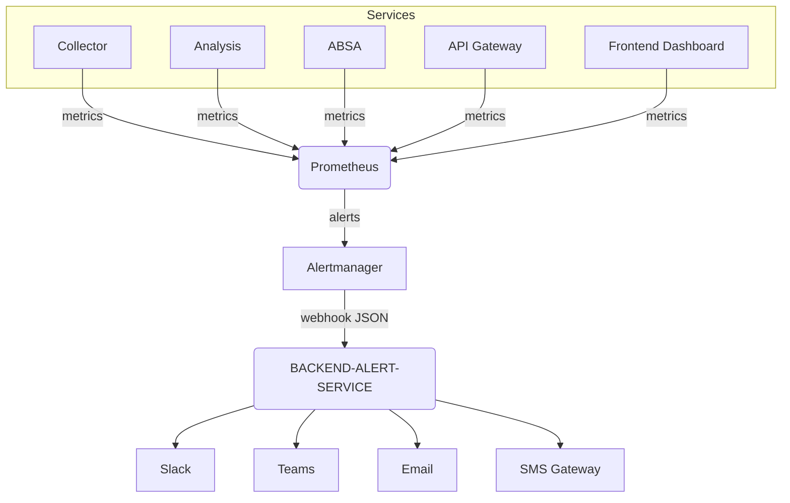

# Observability → Alert Service 통합 파이프라인 설계

## 1. 개요
- **목표**: 관측성 표준화 PRD(`.windsurf/workflows/prd-목적-수행시점/observability-standardization-prd.md`)와 Alert 다중 채널 통합 PRD(`.windsurf/workflows/prd-목적-수행시점/alerting-platform-integration-prd.md`)를 연계하여 Prometheus/Grafana 이벤트를 `BACKEND-ALERT-SERVICE`로 전달하는 파이프라인을 정의한다.
- **범위**: Collector/Analysis/ABSA/Gateway/Frontend 서비스에서 노출하는 메트릭 → Prometheus → Alertmanager → Alert Service → Slack/Teams/Email/SMS.
- **비범위**: Incident 티켓 시스템 연동 세부 구현(별도 PRD 참고), 인프라 배포 자동화(IaC 문서에서 다룸).

## 2. 구성 요소
- **Prometheus 서버**: `monitoring/prometheus.yml`에서 타겟 스크레이프. Exporter는 서비스별 FastAPI/uvicorn Prometheus 미들웨어 및 Node exporter.
- **Alertmanager**: Prometheus 경보를 수신하여 Webhook 리시버(`alert-service`)로 전달.
- **Grafana**: 시각화 및 Alert Rule 관리. Grafana Alert는 Alertmanager REST 혹은 직접 Alert Service Webhook 사용.
- **Alert Service (`BACKEND-ALERT-SERVICE/`)**: 경보 라우팅, 다중 채널 전송, Incident 에스컬레이션.
- **Secret/Config 저장소**: `config/observability/` 하위로 Prometheus/Grafana 설정, 환경 변수는 `.env.example` 확장.

## 3. 데이터 흐름


## 4. 상세 설계
### 4.1 Prometheus 스크레이프
- 각 서비스는 `/metrics` 엔드포인트 노출 (uvicorn + Prometheus middleware).
- 스크레이프 인터벌: 15s (Collector/Analysis), 30s (Gateway/Frontend).
- Target 발견: `monitoring/prometheus.yml`에 Docker Compose 서비스명 기반 정적 설정.

### 4.2 Alert Rule 템플릿
```yaml
# monitoring/alerts/service-latency-rules.yml
groups:
  - name: service-latency
    rules:
      - alert: HighLatency
        expr: histogram_quantile(0.95, rate(http_request_duration_seconds_bucket{service=~"collector|analysis|absa"}[5m])) > 2
        for: 5m
        labels:
          severity: critical
          service: "{{ $labels.service }}"
        annotations:
          summary: "{{ $labels.service }} p95 latency > 2s"
          description: "Investigate upstream dependencies or load spikes"
```
- 심각도(severity): `info|warning|critical`.
- 추가 규칙: `HighErrorRate`, `KafkaLag`, `WebhookFailures` 등 Observability PRD 필수 지표와 매핑.

### 4.3 Alertmanager 구성
```yaml
# monitoring/alertmanager.yml
route:
  receiver: alert-service
  group_by: ['service', 'severity']
  group_wait: 30s
  group_interval: 5m
  repeat_interval: 2h
receivers:
  - name: alert-service
    webhook_configs:
      - url: http://alert-service:8004/api/v1/alerts/prometheus
        send_resolved: true
        http_config:
          bearer_token_file: /run/secrets/alert_service.token
```
- `bearer_token_file`: Alert 서비스에서 발급한 API 토큰 (Secret Manager/Swarm secret).
- 폴백 전략: Alert Service 장애 시 `pagerduty` 같은 외부 채널 추가.

### 4.4 Alert Service 수신 API (초안)
- 엔드포인트: `POST /api/v1/alerts/prometheus`
- 요청 스키마 (Prometheus Webhook v4):
```json
{
  "receiver": "alert-service",
  "status": "firing",
  "alerts": [
    {
      "status": "firing",
      "labels": {
        "alertname": "HighLatency",
        "service": "collector",
        "severity": "critical"
      },
      "annotations": {
        "summary": "collector p95 latency > 2s",
        "description": "Investigate upstream dependencies or load spikes"
      },
      "startsAt": "2025-09-29T09:20:00Z"
    }
  ]
}
```
- Alert Service는 PRD에 정의된 Channel 라우팅 규칙을 적용하여 Slack/Teams/Email/SMS 전송.

### 4.5 Grafana Alert 연동
- Grafana 9+ Alert Rule → Contact Point(Webhook) 정의: `http://alert-service:8004/api/v1/alerts/grafana`.
- Grafana Alert JSON 스키마는 Prometheus와 다르므로 Alert Service에서 별도 파서 구현.
- Grafana Contact Point 예시:
```hcl
apiVersion: 1
contactPoints:
  - name: alert-service-webhook
    type: webhook
    settings:
      url: http://alert-service:8004/api/v1/alerts/grafana
      httpMethod: POST
      maxAlerts: 0
```

### 4.6 보안
- Alert Service Webhook 토큰 필수. Alertmanager/Grafana는 내부 네트워크 혹은 mTLS 사용.
- Prometheus `/metrics` 는 내부 네트워크에서만 노출.
- Secrets: `PROMETHEUS_BEARER_TOKEN`, `GRAFANA_WEBHOOK_TOKEN`, `SLACK_WEBHOOK_URL`, etc.

### 4.7 운영 및 재처리
- Alert Service가 실패 시 DLQ 테이블(`alert_failures`)에 저장하고 재시도.
- Prometheus/Alertmanager 로그는 Loki에 수집하여 Incident 회고에 활용.
- 히스토리 로그: 주요 경보 정책 변경 시 `scripts/history_logger.py`로 기록.

## 5. 배포 및 구성 절차
1. `monitoring/prometheus.yml`에 신규 스크레이프 및 `rule_files` 추가.
2. `monitoring/alertmanager.yml`에 Webhook 리시버 구성.
3. Alert Service에 `PROMETHEUS_TOKEN`, 채널별 시크릿 주입.
4. Grafana Contact Point/Notification Policy 설정.
5. `make monitoring-reload` 혹은 Docker Compose 재시작.
6. 사전 점검:
   - `curl http://prometheus:9090/targets`
   - `curl http://alertmanager:9093/api/v2/status`
   - `curl -X POST .../api/v1/alerts/prometheus` (샘플 페이로드)

## 6. 테스트 전략
- **단위 테스트**: Alert Service Webhook 핸들러의 JSON 파싱/권한 검사.
- **통합 테스트**: Prometheus `amtool alert add`를 사용해 가짜 Alert 발송 → Slack mock 수신 확인.
- **부하 테스트**: Locust/gatling으로 Alert 폭주 시나리오 검증.
- **회귀 테스트**: `validate_project.sh` 확장으로 Alert 구성 파일 lint 검증(`promtool check rules`).

## 7. 문서·도구 연계
- DocSync: 본 문서 front-matter 관리(`doc_sync` 대상).
- Observability PRD, Alerting PRD에 명시된 일정/요구사항 참조 링크 포함.
- 히스토리: 주요 관측성/Alert 변경 시 `DOCUMENTS/HISTORY/` 기록.

## 8. 후속 작업
- Alert Service Jira/Incident 연동 설계(`alerting-platform-integration-prd.md`).
- Prometheus Operator/K8s 배포 시 매니페스트 단순화.
- Grafana Dashboard 템플릿(`monitoring/grafana/dashboards/`) 작성.
- Collector HTTP 상태 코드 계측 및 Alert 룰 추가(크롤링 파이프라인 품질 지표).
- 컴플라이언스 투명성 지표 전용 Grafana 패널 제작.
