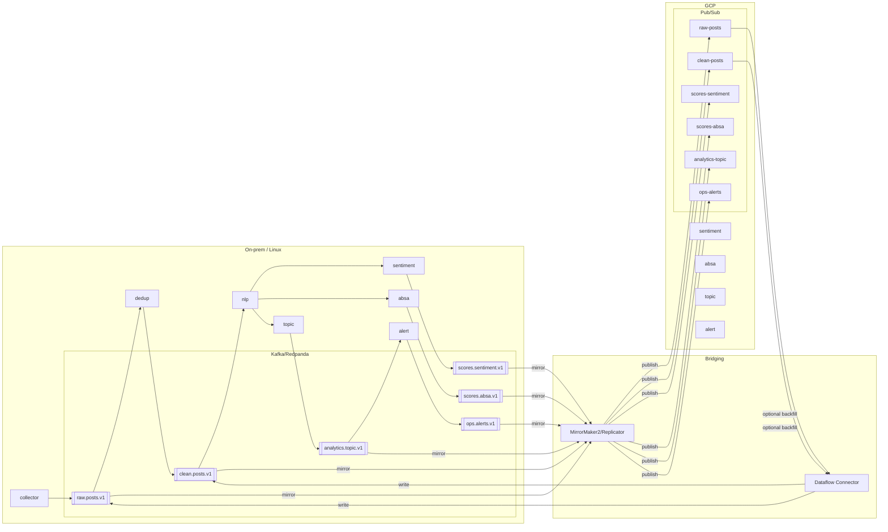

# 시스템 아키텍처: 국민연금 온라인 여론 분석 MSA

## 개요
- 목적: 대규모 비정형 텍스트의 실시간 수집-분석-시각화-알림을 위한 클라우드 네이티브 MSA.
- 설계 원칙: 느슨한 결합, 이벤트 중심, 확장성·관측성 우선, 개인정보 최소화.

## 상위 아키텍처(도메인)
- 수집 영역(Ingestion): 크롤러/커넥터 → Kafka(또는 Pub/Sub) → 원천 저장(Data Lake)
- 처리 영역(Processing): 전처리·비식별 → 토픽 모델링 → 감성/ABSA → 요약/RAG → 피처 저장
- 서빙 영역(Serving): 시계열/통계 저장소 → 검색 인덱스 → 대시보드 API → 실시간 알림
- 운영 영역(Ops): 스케줄러(Airflow), 피처스토어, 모델 서빙, 모니터링/로깅/트레이싱

## 기술 스택 제안(GCP-first, Linux 서버 호환)
- 메시지/이벤트: Pub/Sub(GCP) 또는 Kafka/Redpanda(Linux), Schema Registry(Avro/Protobuf), Kafka Connect 대체는 Dataflow 커넥터 사용 가능
- 저장: Data Lake GCS(GCP) 또는 MinIO/S3 호환(Linux), DW BigQuery(GCP) 또는 ClickHouse(Linux), 검색 ES/OpenSearch, Vector DB pgvector/Milvus
- 처리: Dataflow/Composer/Vertex Pipelines(GCP) 또는 Spark/Flink/Airflow OSS(Linux), Ray Serve/TorchServe
- 백엔드: Python FastAPI/Flask, gRPC(내부), GraphQL(선택)
- 대시보드: React/Next.js + ECharts/Plotly, Grafana(운영 지표)
- 모니터링: Cloud Monitoring/Logging(GCP) 또는 Prometheus+Grafana+Loki(Linux), OpenTelemetry, Sentry
- 배포: GKE/Cloud Run(GCP) 또는 Docker/K8s+ArgoCD(Linux), CI/CD GitHub Actions/Cloud Build

## 마이크로서비스 구성
- collector-service: 채널별 커넥터(포털, 커뮤니티, X, 블로그)
- dedup-anonymizer: 중복 제거, 스팸/봇 필터, NER 기반 비식별화
- nlp-preprocess: 형태소, 정규화, 언어감지
- sentiment-service: 3클래스/8감정 분류 모델 서빙
- absa-service: 정책 속성 추출 및 Aspect별 감성
- topic-modeler: LDA/BERTopic 파이프라인
- summarizer-rag: 문서 임베딩, 벡터 검색, LLM 요약/논거
- event-analysis: ITS/상관 분석 배치 잡
- api-gateway: 인증, 쿼리 집계, 권한
- dashboard-web: 시각화 UI
- alert-service: 임계치/변동성 기반 경보, 채널 연동(Slack/메일)

## 데이터 파이프라인(GCP ↔ Linux 매핑)
1) 수집: 크롤러 → Pub/Sub(`raw-posts`) 또는 Kafka(`raw.posts.v1`)에 게시(스키마 등록)
2) 정제: Dataflow/Composer(GCP) 또는 Spark/Airflow(Linux)로 정규화 → `clean.posts.v1`
3) 비식별: DLP API(GCP) 또는 NER+규칙 기반 마스킹(Linux) → Data Lake/DW 적재(GCS+BQ ↔ MinIO+ClickHouse)
4) 분석: Vertex Endpoint/GKE Serving(GCP) 또는 TorchServe/Ray Serve(Linux)로 추론 → (`scores.sentiment.v1`, `scores.absa.v1`)
5) 집계/지표: BQ 파티션 테이블 또는 ClickHouse 머티리얼라이즈드 뷰
6) 서빙: BigQuery BI Engine/ES ↔ ClickHouse/ES, 대시보드 API 캐시(Redis)

## 스키마(요약)
- Post v1: id, source, channel, url, author_hash, text, created_at, meta{age_band?, gender?}, politics?, tags
- Sentiment v1: post_id, label3, label8, scores{...}, model_ver, infer_ts
- ABSA v1: post_id, aspect, polarity, evidence_span, model_ver
- Topic v1: post_id, topic_id, topic_terms, score
- Event v1: event_id, type, ts, meta

## 보안·권한
- API Key/OAuth2, 서비스 간 mTLS, 비식별 키 관리, 감사 로그.

## 확장/비용 전략
- LLM 호출은 on-demand(요약/논거 요청 시), 캐시·샘플링, 저비용 모델 우선(gemini-2.5-flash-preview-05-20).

## 관측성
- 각 서비스에 요청·지연·오류 메트릭, 파이프라인 SLA 모니터, 모델 드리프트 대시보드.

## Kafka 기반 서비스 간 통신 표준
- 토픽 명명: Kafka `dot.case.version` 예) `raw.posts.v1`, Pub/Sub `hyphen-case` 예) `raw-posts`.
- 파티션: 기본 6–12, 트래픽에 따라 확장. 키는 순서를 보장할 엔터티 기반으로 설정.
- 파티션 키 권장:
  - `raw.posts.v1`: `hash(source + url_norm)`
  - `clean.posts.v1`: `dedup_key`
  - `scores.sentiment.v1`/`scores.absa.v1`/`analytics.topic.v1`: `post_id`
  - `ops.alerts.v1`: `issue`
- 전달 보장: At-least-once. 중복은 idempotent 소비 로직으로 처리(`dedup_key`, `post_id`).
- 순서: 파티션 키 단위 순서 보장. 크로스-키 순서 비보장.
- 재시도/백오프: 지수 백오프. 실패는 `.dlq` 토픽으로 라우팅(예: `raw.posts.dlq`).
- 스키마/레지스트리: Protobuf/Avro + Schema Registry. 호환성 규칙 `BACKWARD` 권장. `schema_version` 헤더 포함.
- 헤더(Attributes): `trace_id`, `span_id`, `schema_version`, `source`, `channel`, `content_type`, `platform_profile`.
- 시큐리티: mTLS + ACL(Kafka), SASL/SCRAM(옵션). Pub/Sub는 IAM 역할 기반. 토픽별 최소권한.
- 브릿징: GCP(Pub/Sub)↔Linux(Kafka)는 커넥터/브릿지(Confluent/Striim/Dataflow)로 미러링. 헤더→Attributes 매핑.
- 컨슈머 그룹: `service-name.env` 표준. 오프셋 커밋은 at-least-once 기준으로 처리.
- 관측성: Lag 모니터, 오프셋/스루풋/에러율 대시보드, OTel로 trace 상관관계.

## 워크플로 다이어그램 (환경 공통)
아래 다이어그램은 환경(GCP/Linux)에 구애받지 않는 서비스 간 데이터 흐름입니다.

```mermaid
flowchart TD
  subgraph Ingestion
    COL[collector-service]
    RAW[[raw.posts.v1]]
  end

  subgraph Processing
    DEDUP[dedup-anonymizer]
    CLEAN[[clean.posts.v1]]
    NLP[nlp-preprocess]
    SENT[sentiment-service]
    S_SCORES[[scores.sentiment.v1]]
    ABSA[absa-service]
    A_SCORES[[scores.absa.v1]]
    TOPIC[topic-modeler]
    T_SCORES[[analytics.topic.v1]]
  end

  subgraph Serving
    API[api-gateway]
    DASH[dashboard-web]
    ALERT[alert-service]
    OPS[[ops.alerts.v1]]
    SUM[summarizer-rag]
  end

  subgraph Storage
    LAKE[(Data Lake)]
    WARE[(DW/BigQuery|ClickHouse)]
    SEARCH[(ES/OpenSearch)]
    VDB[(Vector DB)]
  end

  COL --> RAW
  RAW --> DEDUP
  DEDUP --> CLEAN
  CLEAN --> NLP
  NLP --> SENT
  NLP --> ABSA
  NLP --> TOPIC
  SENT --> S_SCORES
  ABSA --> A_SCORES
  TOPIC --> T_SCORES
  S_SCORES --> WARE
  A_SCORES --> WARE
  T_SCORES --> WARE
  WARE --> API
  API --> DASH
  T_SCORES --> ALERT
  ALERT --> OPS
  API -.-> SUM
  SUM --> API
  RAW --> LAKE
  CLEAN --> LAKE
```

## 환경별 워크플로 다이어그램

### GCP 환경(Pub/Sub, GCS, BigQuery, Vertex)
```mermaid
graph TD
  subgraph Messaging[Pub/Sub]
    RP[raw-posts]
    CP[clean-posts]
    SS[scores-sentiment]
    SA[scores-absa]
    AT[analytics-topic]
    OA[ops-alerts]
  end

  subgraph Compute[Cloud Run / GKE / Vertex]
    CR[collector-service (Cloud Run)]
    DA[dedup-anonymizer (GKE/Composer)]
    NP[nlp-preprocess (GKE)]
    SE[sentiment-service (Vertex/Ray)]
    AB[absa-service (Vertex/Ray)]
    TM[topic-modeler (GKE)]
    AGW[api-gateway (Cloud Run)]
    ALS[alert-service (Cloud Run)]
    SUM[summarizer-rag (Cloud Run)]
  end

  subgraph Storage[GCP Storage]
    GCS[(GCS Data Lake)]
    BQ[(BigQuery DW)]
    ES[(Elastic Cloud/Search)]
    VDB[(AlloyDB/CloudSQL + pgvector)]
  end

  CR --> RP
  RP --> DA
  DA --> CP
  CP --> NP
  NP --> SE
  NP --> AB
  NP --> TM
  SE --> SS
  AB --> SA
  TM --> AT
  SS --> BQ
  SA --> BQ
  AT --> BQ
  BQ --> AGW
  ES --> AGW
  VDB --> AGW
  AGW -->|/v1/*| SUM
  AT --> ALS
  ALS --> OA
  RP --> GCS
  CP --> GCS
```

### Linux 서버 환경(Kafka/Redpanda, MinIO, ClickHouse)
```mermaid
graph TD
  subgraph Messaging[Kafka/Redpanda]
    RAW[[raw.posts.v1]]
    CLN[[clean.posts.v1]]
    SSV[[scores.sentiment.v1]]
    SAV[[scores.absa.v1]]
    ATV[[analytics.topic.v1]]
    OAV[[ops.alerts.v1]]
  end

  subgraph Compute[Docker/K8s]
    CLC[collector-service]
    DED[dedup-anonymizer]
    NLP[nlp-preprocess]
    SEN[sentiment-service (TorchServe/Ray)]
    ABS[absa-service (TorchServe/Ray)]
    TOP[topic-modeler (Spark/Flink)]
    GW[api-gateway (FastAPI)]
    ALT[alert-service]
    SUM[summarizer-rag]
  end

  subgraph Storage[On-prem Storage]
    MIO[(MinIO/S3)]
    CH[(ClickHouse DW)]
    OSE[(OpenSearch/ES)]
    PGV[(Postgres + pgvector)]
  end

  CLC --> RAW
  RAW --> DED
  DED --> CLN
  CLN --> NLP
  NLP --> SEN
  NLP --> ABS
  NLP --> TOP
  SEN --> SSV
  ABS --> SAV
  TOP --> ATV
  SSV --> CH
  SAV --> CH
  ATV --> CH
  CH --> GW
  OSE --> GW
  PGV --> GW
  GW -->|/v1/*| SUM
  ATV --> ALT
  ALT --> OAV
  RAW --> MIO
  CLN --> MIO
```

### 하이브리드(브릿지) 환경 (Kafka ↔ Pub/Sub)


## 다이어그램 표기 규칙
- 대괄호 `[]`: 서비스/컴퓨팅 노드
- 이중 대괄호 `[[ ]]`: 메시징 토픽/채널
- 둥근 괄호 `()` : 저장소
- 점선 화살표 `-.->`: 비동기/옵션 경로
- `|/v1/*|` 라벨: REST 엔드포인트 호출
