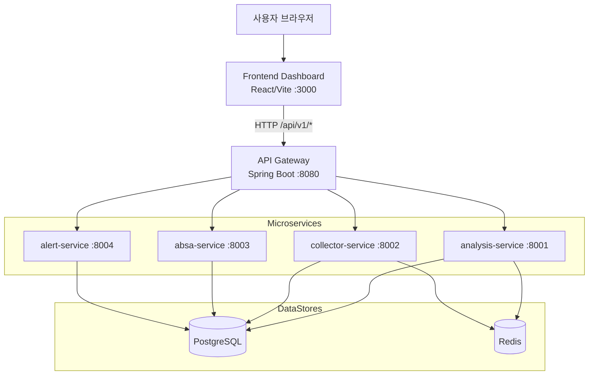

# 백엔드 API 기술 명세서

본 문서는 국민연금 온라인 여론 분석·정책 피드백 시스템의 **백엔드 API**를 기술적으로 설명하기 위한 명세서입니다. 실제 구현된 코드(`docker-compose.spring.yml`, Spring Boot API Gateway, `FRONTEND-DASHBOARD/src/lib/api.ts`)를 기반으로 작성되며, 코드로부터 직접 확인되지 않는 부분은 **"추가 확인 필요"**로 표기합니다.

---

## 1. 시스템 아키텍처 개요 (Architecture Overview)

### 1.1 전체 구조

시스템은 **API Gateway + Microservices** 기반의 MSA(Microservice Architecture)로 구성되어 있습니다.

- **Frontend Dashboard** (`FRONTEND-DASHBOARD`, 포트 `3000`)
  - Vite + React + TypeScript 기반 CSR(Client-Side Rendering) 대시보드
  - `/api/v1/*` 경로로 API Gateway를 호출
- **API Gateway** (`api-gateway`, 포트 `8080`)
  - Spring Boot 기반 게이트웨이 서비스
  - 모든 외부 요청의 단일 진입점
  - 내부 마이크로서비스로 라우팅: `analysis-service`, `collector-service`, `absa-service`, `alert-service`, OSINT 관련 서비스 등
- **Analysis Service** (`analysis-service`, 포트 `8001`)
  - 감성 분석, 트렌드 분석 등 분석 로직 담당
  - `/api/v1/sentiment/stats`, `/api/v1/trends/analyze`, `/api/v1/trends/popular`, `/api/v1/trends/keywords` 등의 엔드포인트를 게이트웨이 통해 제공한다고 추정 (**정확한 내부 매핑은 추가 확인 필요**)
- **Alert Service** (`alert-service`, 포트 `8004`)
  - 알림 규칙/알림 이벤트 관리
  - `/api/v1/alerts`, `/api/v1/alerts/rules`, `/api/v1/alerts/{id}/acknowledge`, `/api/v1/alerts/{id}/resolve` 등 제공
- **데이터 스토어**
  - PostgreSQL (pgvector 포함): 분석/알림 등 영속 데이터 저장
  - Redis: 캐시 및 세션/단기 데이터 저장
- **기타 서비스**
  - Collector, ABSA, OSINT 관련 서비스는 데이터 수집/속성 기반 감성 분석/외부 정보 수집을 담당 (**구체 API는 별도 문서 및 코드 확인 필요**)

### 1.2 데이터 흐름 (Data Flow)

사용자 관점의 주요 데이터 흐름은 다음과 같습니다.

1. 사용자가 웹 브라우저에서 `http://localhost:3000`의 대시보드에 접근
2. Frontend는 React 컴포넌트 내부에서 `src/lib/api.ts`의 API 클라이언트 함수를 통해 `http://localhost:8080/api/v1/...`로 HTTP 요청 전송
3. API Gateway는 요청 URI에 따라 적절한 마이크로서비스(`analysis-service`, `alert-service` 등)로 요청을 라우팅
4. 마이크로서비스는 PostgreSQL/Redis 등에 접근해 필요한 데이터를 조회/계산 후 응답 JSON을 반환
5. API Gateway는 응답을 호출자(Frontend)에 그대로 전달
6. Frontend는 응답 데이터를 시각화(차트, 카드, 테이블 등)하여 사용자에게 표시

#### 1.2.1 전체 플로우 다이어그램 (Mermaid)



### 1.3 주요 기술 스택 및 라이브러리

- **Backend**
  - Java Spring Boot (API Gateway 및 도메인 마이크로서비스)
  - PostgreSQL (pgvector 확장)
  - Redis (캐시)
  - Docker Compose (로컬 개발 환경 구성)
- **Frontend** (참고용)
  - Vite, React, TypeScript
  - Recharts (차트 시각화)
  - shadcn/ui, Tailwind CSS (UI 컴포넌트 및 스타일)
- **관측성/알림**
  - Prometheus, Alertmanager, Grafana, Alert Service 연동 (상세는 `DOCUMENTS/ARCHITECTURE/observability-alert-pipeline.md` 참조)

---

## 2. API 엔드포인트 명세 (API Specifications)

아래 표는 `src/lib/api.ts` 및 아키텍처 문서를 기준으로, 실제 프론트엔드가 사용하는 핵심 백엔드 API 엔드포인트를 정리한 것입니다.

> ⚠️ 인증/인가 방식은 코드 상에 명시된 Authorization 헤더가 없어 **추가 확인 필요**입니다.

| HTTP Method | Endpoint URI                                   | 기능 설명                                                         | 인증 필요 여부 |
|------------|--------------------------------------------------|------------------------------------------------------------------|----------------|
| GET        | `/api/v1/sentiment/stats`                       | 기간별 전체 감성 통계 조회 (긍정/부정/중립/total 집계)           | 추가 확인 필요 |
| POST       | `/api/v1/trends/analyze`                        | 기간·엔터티 기반 감성 트렌드 분석 (시계열 데이터 포인트 반환)   | 추가 확인 필요 |
| GET        | `/api/v1/trends/popular`                        | 인기 트렌드/이슈 목록 조회 (엔티티별 볼륨·감성 지표)            | 추가 확인 필요 |
| GET        | `/api/v1/trends/keywords`                       | 키워드 랭킹 조회 (기간 기반 상위 키워드, 빈도/감성 포함)        | 추가 확인 필요 |
| GET        | `/api/v1/alerts`                                | 경보(알림) 목록 조회 (상태, 심각도, 메타데이터 포함)            | 추가 확인 필요 |
| POST       | `/api/v1/alerts/{id}/acknowledge`               | 특정 경보에 대한 "인지(acknowledge)" 처리                      | 추가 확인 필요 |
| POST       | `/api/v1/alerts/{id}/resolve`                   | 특정 경보에 대한 "해결(resolve)" 처리                          | 추가 확인 필요 |
| GET        | `/api/v1/alerts/rules`                          | 경보 규칙(Alert Rule) 목록 조회                                 | 추가 확인 필요 |
| PATCH      | `/api/v1/alerts/rules/{id}`                     | 경보 규칙 활성/비활성 토글 등 상태 변경                         | 추가 확인 필요 |
| (추정)     | `/api/v1/analysis/*`                            | 분석 서비스 관련 엔드포인트 그룹 (상세 URI는 추가 확인 필요)    | 추가 확인 필요 |
| (추정)     | `/api/v1/collector/*`                           | 수집 서비스 관련 엔드포인트 그룹 (상세 URI는 추가 확인 필요)    | 추가 확인 필요 |
| (추정)     | `/api/v1/absa/*`                                | ABSA 서비스 관련 엔드포인트 그룹 (상세 URI는 추가 확인 필요)    | 추가 확인 필요 |

> ※ Persona 관련 `/api/v1/personas/*` 엔드포인트는 프론트 컴포넌트에서 사용되나, 정확한 스펙은 API 코드가 제공되지 않아 **추가 확인 필요**입니다.

---

## 3. 주요 데이터 포맷 및 스키마 (Key Data Formats)

여기서는 핵심 비즈니스 로직과 직접 연결된 API 세 가지에 대해 요청/응답/에러 스펙을 예시와 함께 상세히 설명합니다.

- **GET `/api/v1/sentiment/stats`**: 전체 감정 통계 조회
- **POST `/api/v1/trends/analyze`**: 감정 트렌드 시계열 분석
- **GET `/api/v1/alerts`**: 알림 목록 조회

### 3.1 GET `/api/v1/sentiment/stats`

#### 3.1.1 개요

- 기능: 지정된 기간에 대한 전체 감정 통계를 반환
- 제공 정보: 긍정/부정/중립 건수 및 전체 분석 건수
- 사용처: 메인 대시보드, 실시간 대시보드, Analytics 페이지 등

#### 3.1.2 요청 형식

- HTTP Method: `GET`
- Query Parameters:
  - `startDate` (string, optional): 조회 시작일 (예: `2025-10-01`)
  - `endDate` (string, optional): 조회 종료일 (예: `2025-10-07`)

예:

```http
GET /api/v1/sentiment/stats?startDate=2025-10-01&endDate=2025-10-07 HTTP/1.1
Host: localhost:8080
```

#### 3.1.3 응답 형식 (성공)

백엔드 구현에 따라 두 가지 형태가 혼재할 수 있어, 프론트에서는 이를 표준 `SentimentStats`로 정규화 합니다.

예시 응답 (백엔드 원본 형태):

```json
{
  "positive_count": 12345,
  "negative_count": 6789,
  "neutral_count": 2345,
  "total_analyses": 21479
}
```

또는 (대체 필드명 사용 시):

```json
{
  "positive": 12345,
  "negative": 6789,
  "neutral": 2345,
  "total": 21479
}
```

프론트 기준 표준 스키마 (`SentimentStats`):

```ts
interface SentimentStats {
  positive: number;
  negative: number;
  neutral: number;
  total: number;
}
```

- `positive`: 긍정 분석 건수
- `negative`: 부정 분석 건수
- `neutral`: 중립 분석 건수
- `total`: 전체 분석 건수

#### 3.1.4 에러 케이스

프론트 코드에서 `response.ok`가 아닌 경우 단순히 예외를 발생시키므로, 구체적인 상태 코드는 백엔드 구현 참고가 필요합니다.

- `400 Bad Request` – 잘못된 날짜 형식 또는 파라미터 (`startDate`, `endDate`)  **(추가 확인 필요)**
- `500 Internal Server Error` – 내부 서버 오류 **(추가 확인 필요)**

프론트는 에러 시 메시지:

- "Failed to fetch sentiment stats" 또는 상위 호출자에서 번역된 사용자 친화적 메시지 표시

---

### 3.2 POST `/api/v1/trends/analyze`

#### 3.2.1 개요

- 기능: 특정 기간과 엔터티(예: 전체, 특정 토픽 등)에 대한 감정 트렌드(시계열)를 분석
- 사용처: 실시간 대시보드, Explore 페이지, Analytics 감정 추이 그래프

#### 3.2.2 요청 형식

- HTTP Method: `POST`
- Headers:
  - `Content-Type: application/json`
- Request Body (프론트 기준):

```json
{
  "period": "daily",
  "entity": "global",
  "start_date": "2025-10-01",
  "end_date": "2025-10-07"
}
```

- `period` (string, 필수): 집계 단위. 현재 구현에서는 `daily` 사용 (다른 값 지원 여부는 **추가 확인 필요**)
- `entity` (string, 필수): 분석 대상 엔터티. 예: `"global"`, 특정 키워드/토픽 ID 등 (**구체 스펙은 추가 확인 필요**)
- `start_date` / `end_date` (string, optional): 분석 기간 (ISO 날짜 문자열)

프론트에서의 호출 예 (`fetchSentimentTrend`):

```ts
fetch("/api/v1/trends/analyze", {
  method: "POST",
  headers: { "Content-Type": "application/json" },
  body: JSON.stringify({ period: "daily", entity: "global", start_date, end_date })
});
```

#### 3.2.3 응답 형식 (성공)

프론트에서는 `data.data_points` 배열을 기대하며, 각 요소는 다음과 같은 구조입니다.

예시 응답:

```json
{
  "data_points": [
    {
      "date": "2025-10-01",
      "sentiment_score": 0.35,
      "volume": 1234
    },
    {
      "date": "2025-10-02",
      "sentiment_score": -0.1,
      "volume": 1456
    }
  ]
}
```

- `date` (string): 집계 일자 (ISO 날짜 또는 `YYYY-MM-DD` 포맷)
- `sentiment_score` (number): -1.0 ~ 1.0 범위의 감성 점수라고 추정 (**정확한 범위는 추가 확인 필요**)
- `volume` (number): 해당 일자에 분석된 건수 (언급 수)

프론트 표준 변환 예 (`Analytics.tsx`):

- `sentiment_score`를 이용해 긍/부 분리
- `volume`을 이용해 총 건수 계산

#### 3.2.4 에러 케이스

- `400 Bad Request` – 잘못된 `period` 값 또는 날짜 범위 **(추가 확인 필요)**
- `500 Internal Server Error` – 내부 오류 **(추가 확인 필요)**

프론트는 에러 시:

- 예외를 던지고 상위 컴포넌트에서 "데이터를 불러오지 못했습니다. 잠시 후 다시 시도해주세요." 등의 메시지 표시

---

### 3.3 GET `/api/v1/alerts`

#### 3.3.1 개요

- 기능: 시스템에서 발생한 Alert(경보) 목록을 조회
- Alert Rule/관측성 파이프라인과 연동되어, 임계값 초과/오류 등 이벤트 발생 시 생성된 알림을 관리
- 사용처: Alerts 페이지, 알림 관리 화면

#### 3.3.2 요청 형식

- HTTP Method: `GET`
- Query Parameters:
  - `limit` (number, optional): 최대 조회 개수
  - `status` (string, optional): 필터링할 상태 값 (`pending`, `active`, `resolved`, `dismissed` 등으로 추정, **정확한 목록은 추가 확인 필요**)

예:

```http
GET /api/v1/alerts?limit=20&status=active HTTP/1.1
Host: localhost:8080
```

#### 3.3.3 응답 형식 (성공)

프론트 인터페이스(`AlertItem`)에 기반한 표준 스키마:

```ts
interface AlertItem {
  id: number;
  title: string;
  message: string;
  severity: "low" | "medium" | "high" | "critical";
  status: "pending" | "active" | "resolved" | "dismissed";
  triggered_at: string;
  acknowledged_at?: string | null;
  acknowledged_by?: string | null;
  source_service?: string | null;
  threshold_value?: number | null;
  actual_value?: number | null;
  rule_id?: number;
  metadata?: any;
}
```

예시 응답:

```json
[
  {
    "id": 101,
    "title": "Collector p95 latency > 2s",
    "message": "collector-service의 p95 응답 시간이 2초를 초과했습니다.",
    "severity": "critical",
    "status": "active",
    "triggered_at": "2025-10-07T12:34:56Z",
    "acknowledged_at": null,
    "acknowledged_by": null,
    "source_service": "collector-service",
    "threshold_value": 2.0,
    "actual_value": 2.7,
    "rule_id": 12,
    "metadata": {
      "metric": "http_request_duration_seconds_p95",
      "environment": "dev"
    }
  },
  {
    "id": 102,
    "title": "Negative sentiment spike",
    "message": "지난 1시간 동안 부정 감성이 급증했습니다.",
    "severity": "high",
    "status": "resolved",
    "triggered_at": "2025-10-06T09:10:00Z",
    "acknowledged_at": "2025-10-06T09:20:00Z",
    "acknowledged_by": "analyst01",
    "source_service": "analysis-service",
    "threshold_value": 0.7,
    "actual_value": 0.82,
    "rule_id": 15,
    "metadata": {
      "window": "60m",
      "channel": "online-news"
    }
  }
]
```

#### 3.3.4 관련 API: Acknowledge / Resolve / Rules

- `POST /api/v1/alerts/{id}/acknowledge`
  - Body (optional): `{ "userId": "analyst01" }`
  - 기능: Alert를 "인지" 상태로 변경, `acknowledged_at`, `acknowledged_by` 필드 갱신
- `POST /api/v1/alerts/{id}/resolve`
  - Body (optional): `{ "userId": "analyst01" }`
  - 기능: Alert를 "resolved" 상태로 변경, 해결 이력 추적
- `GET /api/v1/alerts/rules`
  - Alert Rule 목록 조회 (`AlertRule` 인터페이스 기반)
- `PATCH /api/v1/alerts/rules/{id}`
  - Body (optional): `{ "enabled": true }`
  - 기능: 해당 Rule 활성/비활성 토글 등 설정 변경

#### 3.3.5 에러 케이스

- `400 Bad Request` – 잘못된 `limit`/`status` 값, 존재하지 않는 Alert/Rule ID 등 (**상세 스펙 추가 확인 필요**)
- `404 Not Found` – 존재하지 않는 Alert 또는 Rule ID (**추가 확인 필요**)
- `500 Internal Server Error` – 내부 오류 (**추가 확인 필요**)

프론트는 공통적으로 `!response.ok` 시 예외를 발생시키며, Alerts 페이지에서 사용자 친화적인 오류 메시지를 출력합니다.

---

## 4. 미확인/추가 확인 필요 항목

- 인증/인가 방식 (JWT/OAuth2 등) 및 권한 모델
- `/api/v1/analysis/*`, `/api/v1/collector/*`, `/api/v1/absa/*`의 상세 URI 및 스키마
- `sentiment_score` 값의 정확한 범위 및 정의
- Alerts/Alert Rules의 전체 상태/심각도 값 목록
- Persona 관련 `/api/v1/personas/*` 엔드포인트 스펙

이 항목들은 백엔드(Spring Boot) 코드 및 API 문서를 추가로 확인한 후 보완해야 합니다.
