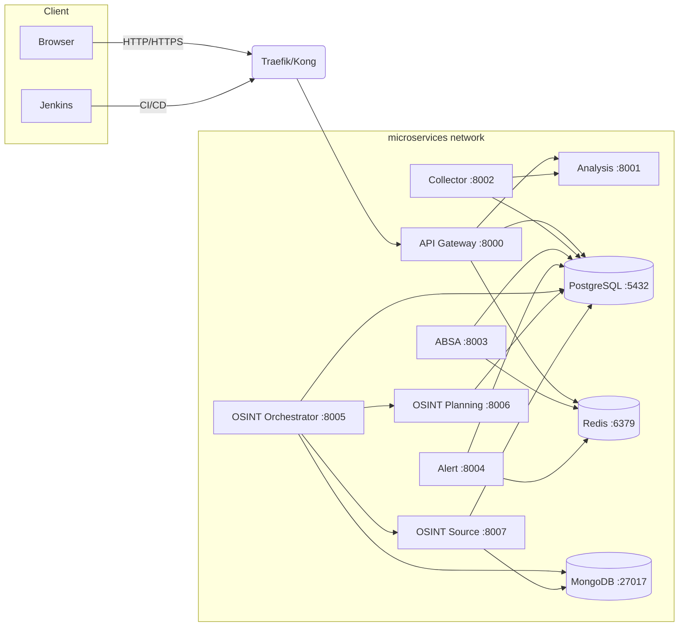

# P1 공통 인프라 및 거버넌스 표준 초안

본 문서는 `tasks-refactor-envmanage.json`의 P1 단계(공통 인프라 및 거버넌스 정립)에서 요구되는 두 개의 핵심 산출물 초안입니다.

- **P1-T1**: microservices 네트워크 및 라우팅 표준화
- **P1-T2**: 환경 변수 및 비밀 분류 정책 수립

## 1. microservices 네트워크 및 라우팅 표준 (P1-T1)

### 1.1 네트워크 개요

- **공유 네트워크명**: `microservices`
- **네트워크 타입**: Docker bridge (필요 시 Swarm/Kubernetes 오버레이로 이관)
- **DNS 규칙**: `<service-name>.<network>.internal` 포맷을 기본으로 하며, Compose 기본 DNS(`service-name`)와의 호환성을 유지합니다.
- **포트 정책**:
  - 애플리케이션 계층(8000~8099): 서비스별 고정 포트 할당
  - 인프라 계층: 표준 포트 고정 (PostgreSQL 5432, Redis 6379, Mongo 27017 등)
  - 향후 신규 서비스는 8100번 이후 구간에서 예약 후 등록

### 1.2 네트워크 다이어그램 (Mermaid)



> **비고**: 실제 배포 시 Traefik/Kong과의 연동 도식은 IaC 리포지토리에서 최신화하고, 네트워크 보안 그룹 및 방화벽 규칙은 별도 문서에 기록합니다.

### 1.3 서비스별 포트 & DNS 매핑

| 영역 | 서비스 | 컨테이너 포트 | 호스트 포트(기본) | DNS 레이블 | 비고 |
| --- | --- | --- | --- | --- | --- |
| 인프라 | PostgreSQL | 5432 | 5432 | `postgres.microservices.internal` | pgvector 확장 포함 |
| 인프라 | Redis | 6379 | 6379 | `redis.microservices.internal` | 세션/캐시 |
| 인프라 | MongoDB | 27017 | 27017 | `mongo.microservices.internal` | OSINT 원천 데이터 |
| 앱 | API Gateway | 8000 | 8000 | `api-gateway.microservices.internal` | 외부 트래픽 진입점 |
| 앱 | Analysis Service | 8001 | 8001 | `analysis-service.microservices.internal` | 모델 인퍼런스 |
| 앱 | Collector Service | 8002 | 8002 | `collector-service.microservices.internal` | 웹/뉴스 수집 |
| 앱 | ABSA Service | 8003 | 8003 | `absa-service.microservices.internal` | 세부 감성 분석 |
| 앱 | Alert Service | 8004 | 8004 | `alert-service.microservices.internal` | 알림 발송 |
| 앱 | OSINT Orchestrator | 8005 | 8005 | `osint-orchestrator.microservices.internal` | 태스크 오케스트레이션 |
| 앱 | OSINT Planning | 8006 | 8006 | `osint-planning.microservices.internal` | 전략 수립 |
| 앱 | OSINT Source | 8007 | 8007 | `osint-source.microservices.internal` | 소스 관리 |
| 프런트 | Dashboard | 3000 | 3000 | `dashboard.microservices.internal` | 선택적 프런트엔드 |

### 1.4 Traefik/Kong 라우팅 규칙 샘플

```yaml
# traefik_dynamic.yml
http:
  routers:
    api-gateway:
      rule: "Host(`api.example.com`)"
      service: api-gateway
      entryPoints:
        - websecure
      tls:
        certResolver: letsencrypt
  services:
    api-gateway:
      loadBalancer:
        servers:
          - url: "http://api-gateway:8000"
```

```yaml
# kong declarative config (snippet)
services:
  - name: api-gateway
    url: http://api-gateway:8000
    routes:
      - name: api-gateway-route
        hosts:
          - api.example.com
        protocols:
          - https
        strip_path: false
```

### 1.5 운영 가이드라인

1. 신규 서비스는 포트 및 DNS 레이블을 **사전 예약** 후 IaC 리포지토리에 PR로 반영합니다.
2. 헬스체크 엔드포인트(`GET /health` 혹은 `GET /ready`)는 모든 서비스에서 필수 구현합니다.
3. 네트워크 정책(추후 Cilium/Calico 도입 시)은 `microservices` 네임스페이스 단위로 정의하고, 서비스 간 허용 트래픽을 최소화합니다.
4. 스테이징/프로덕션 환경은 동일한 포트 체계를 유지하며, 외부 노출 포트는 보안 장비에서 제한합니다.

## 2. 환경 변수 & 비밀 분류 정책 (P1-T2)

### 2.1 Consul KV 네임스페이스 구조

```text
config/
  <service>/
    global/
      settings/          # 공통 설정 (예: 로그 레벨)
    <environment>/       # dev, staging, prod
      secrets/           # 민감 정보 (토큰, 비밀번호)
      configs/           # 비민감 구성 (엔드포인트, 기능 토글)
      credentials/jenkins/<job>/   # Jenkins Job 스코프별 임시 크리덴셜
```

- **환경 식별자**: `dev`, `staging`, `prod` (필요 시 `sandbox`, `qa` 확장)
- **키 포맷**: `config/<service>/<environment>/<category>/<key>`
- **버전 관리**: seed 데이터는 `infra/consul/seeds/<environment>/<service>.hcl` 형태로 Git에 저장하고, Jenkins 파이프라인에서 HCL → KV 반영 스크립트를 호출합니다.

### 2.2 키 분류 기준

| 카테고리 | 예시 키 | 노출 정책 | 저장소 |
| --- | --- | --- | --- |
| `configs` | `DEFAULT_TIMEOUT`, `FEATURE_FLAGS/*` | 서비스 레이어에서 읽기 가능 | Consul KV, .env 템플릿 |
| `secrets` | `DATABASE_PASSWORD`, `JWT_SECRET`, `SLACK_WEBHOOK` | 토큰 기반 접근만 허용 | Consul KV (암호화), Vault 연동 고려 |
| `settings` | `LOG_LEVEL`, `METRICS_ENABLED` | 읽기 전용, 모든 환경 공통 | Consul KV, 문서화 |
| `credentials` | `jenkins/api-deploy/token` | Jenkins Job 실행 시 임시 사용 | Jenkins Credentials + Consul 일시 저장 |

### 2.3 Consul ACL 정책 초안

```hcl
# policy: kv-config-reader
key_prefix "config/" {
  policy = "read"
}

# policy: kv-config-writer
key_prefix "config/" {
  policy = "write"
}

# policy: kv-secret-reader-prod
key_prefix "config/*/prod/secrets/" {
  policy = "read"
}

# policy: kv-secret-writer-dev
key_prefix "config/*/dev/secrets/" {
  policy = "write"
}
```

### 2.4 접근 제어 매트릭스

| 역할 | 사용 주체 | Consul 권한 | Jenkins Credential | 비고 |
| --- | --- | --- | --- | --- |
| `consul-ops-admin` | SRE/DevOps | `config/*` read/write, ACL 관리 | `CONSUL_HTTP_TOKEN_ADMIN` | 초기 설정 및 긴급 대응 |
| `consul-ci-agent` | Jenkins | `config/*/<env>/configs` read/write, `secrets` 읽기 전용 | 폴더/파이프라인 스코프 Token | 배포 전/후 KV 업데이트 |
| `service-runtime` | 각 마이크로서비스 | `config/<service>/<env>/configs` read, `secrets` read | sidecar/agent 토큰 | 애플리케이션이 직접 Consul을 조회할 때 |
| `auditor` | Security 팀 | read-only 전 영역 | 6개월 주기 토큰 갱신 | 감사 로그 검토 |

> **토큰 수명**: 운영 환경 토큰은 90일, 개발/스테이징은 30일 기본. 만료 7일 전 Jenkins에서 Slack 알림 자동 발송.

### 2.5 Jenkins Credential Binding 가이드

- Jenkins 폴더/파이프라인 Credentials에 다음을 등록:
  - `CONSUL_HTTP_ADDR`: Consul 엔드포인트 (예: `https://consul.dev.internal:8501`)
  - `CONSUL_HTTP_TOKEN`: 역할에 맞는 ACL 토큰
  - 필요 시 `CONSUL_CACERT`: TLS 검증용 루트 인증서 경로
- `withCredentials` 혹은 Declarative Pipeline `environment` 블럭을 사용해 스크립트에 주입
- 파이프라인 실패 시 토큰이나 민감 값이 로그에 남지 않도록 `set +x` 적용 및 Mask 설정 필수

### 2.6 MkDocs 빌드 시 비밀 노출 방지

1. MkDocs 빌드 컨테이너에는 `config/*/secrets` 경로 접근 권한을 부여하지 않습니다.
2. 문서 자동화 스크립트(`doc_sync`)는 Consul에서 `configs`만 조회하며, 민감 키는 Mock 값으로 치환합니다.
3. PR 리뷰 시 Secret 문자열 검색(`git secrets`, `detect-secrets`)을 필수 체크에 포함합니다.

### 2.7 초기화 & 싱크 스크립트 연계 포인트

- `init-consul-kv.sh` (P2-T3 산출물 예정)에서 본 구조를 참고하여 `ENVIRONMENT` 파라미터에 따라 KV를 채웁니다.
- Jenkins 파이프라인은 배포 직전 다음 단계 수행:
  1. `configs` 섹션 업데이트 (`app_version`, `deployment_timestamp` 등)
  2. `secrets`는 Vault/Secret Manager에서 주입 후 Consul에 TTL 기반으로 반영 (옵션)
  3. 실패 시 롤백 단계에서 이전 값으로 복원

---

### 다음 단계 권고

1. IaC 리포지토리(`config/compose`)의 Compose 파일을 본 표준에 맞춰 네트워크명과 포트 주석을 업데이트합니다.
2. Consul ACL 정책을 Terraform 또는 Helm 차트에 변수화하여 재사용할 수 있도록 정리합니다.
3. Jenkins Shared Library에 Consul 토큰 마스킹 유틸을 추가하여 운영 리스크를 줄입니다.
