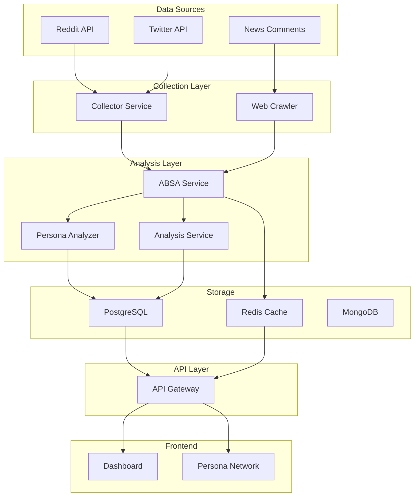

# 국민연금 감정분석 시스템 통합 가이드

## 📋 시스템 개요

본 시스템은 국민연금 관련 온라인 여론을 수집, 분석하여 페르소나 기반 감정 분석을 제공합니다.

### 🎯 핵심 기능
1. **실시간 데이터 수집**: Reddit, Twitter, 뉴스 댓글 등 다양한 소스에서 데이터 수집
2. **ABSA 감정 분석**: 속성 기반 감정 분석으로 세부적인 의견 파악
3. **페르소나 추적**: 작성자의 히스토리를 추적하여 종합적인 성향 분석
4. **메시 네트워크 시각화**: 사용자 간 관계를 D3.js 기반 네트워크로 시각화

## 🏗 시스템 아키텍처



## 💾 데이터 모델

### UserPersona (사용자 페르소나)
- `user_id`: 고유 식별자
- `username`: 사용자명
- `profile_data`: JSON 형태의 프로필 데이터
  - `sentiment_distribution`: 감정 분포
  - `key_topics`: 주요 관심사
  - `activity_patterns`: 활동 패턴
  - `influence_score`: 영향력 점수

### UserConnection (사용자 연결)
- `user1_id`, `user2_id`: 연결된 사용자
- `connection_strength`: 연결 강도
- `avg_sentiment`: 평균 감정
- `common_topics`: 공통 주제

### Content (수집된 콘텐츠)
- `content_id`: 고유 식별자
- `author`: 작성자
- `sentiment_score`: 감정 점수
- `aspects_analysis`: ABSA 분석 결과

## 🚀 실행 방법

### 1. 환경 설정
```bash
# .env.msa 파일 설정
cp .env.msa.example .env.msa
# 필요한 API 키 설정 (GEMINI_API_KEY 등)
```

### 2. 서비스 시작
```bash
# 전체 서비스 시작
docker-compose -f docker-compose.msa.yml up -d

# 특정 서비스만 재시작
docker-compose -f docker-compose.msa.yml restart absa-service
```

### 3. 서비스 상태 확인
```bash
# 헬스체크
curl http://localhost:8000/health

# 서비스별 헬스체크
for port in 8000 8001 8002 8003 8004 8005 8006 8007; do
    echo "Port $port: $(curl -s http://localhost:$port/health | jq -r .status)"
done
```

## 📊 페르소나 분석 사용법

### 1. 사용자 페르소나 분석
```bash
curl -X GET "http://localhost:8003/api/v1/personas/user123/analyze?platform=reddit&depth=50"
```

### 2. 페르소나 네트워크 조회
```bash
curl -X GET "http://localhost:8003/api/v1/personas/network/user123?depth=2"
```

### 3. 트렌딩 페르소나
```bash
curl -X GET "http://localhost:8003/api/v1/personas/trending?time_window=24&limit=10"
```

## 🎨 프론트엔드 시각화

### PersonaNetwork 컴포넌트
- D3.js 기반 포스 레이아웃
- 실시간 상호작용 (드래그, 줌)
- 노드 크기: 영향력 점수
- 링크 색상: 감정 (긍정/부정/중립)
- 링크 두께: 연결 강도

### 사용 예시
```jsx
import PersonaNetwork from '@/components/PersonaNetwork';

function App() {
  return (
    <PersonaNetwork 
      userId="user123"
      onNodeClick={(node) => console.log('Selected:', node)}
    />
  );
}
```

## 🔍 실제 데이터 검증

### Mock 데이터 제거 확인
- `ABSAService`: 실제 감성 사전 기반 분석
- `PersonaAnalyzer`: DB에서 실제 사용자 히스토리 조회
- 모든 랜덤 값 생성 코드 제거

### 데이터 소스 추적
```sql
-- 사용자 활동 추적 확인
SELECT u.username, COUNT(c.id) as post_count, 
       AVG(c.sentiment_score) as avg_sentiment
FROM user_personas u
JOIN contents c ON c.author = u.username
GROUP BY u.username
ORDER BY post_count DESC;

-- 연결 관계 확인
SELECT uc.*, up1.username as user1_name, up2.username as user2_name
FROM user_connections uc
JOIN user_personas up1 ON uc.user1_id = up1.user_id
JOIN user_personas up2 ON uc.user2_id = up2.user_id
WHERE uc.connection_strength > 0.5;
```

## 📈 성능 최적화

### 캐싱 전략
- Redis: 페르소나 프로필 24시간 캐싱
- 자주 조회되는 네트워크 데이터 캐싱

### 데이터베이스 인덱스
- `user_personas`: user_id, username, platform
- `user_connections`: user1_id, user2_id, connection_strength
- `contents`: author, source, created_at

## 🔐 보안 고려사항

1. **API 키 관리**: 환경 변수 사용
2. **Rate Limiting**: API Gateway에서 처리
3. **데이터 익명화**: 민감 정보 해싱 처리
4. **CORS 설정**: 프로덕션에서는 특정 도메인만 허용

## 📝 트러블슈팅

### 문제: Alert Service TypeError
```bash
TypeError: AlertService() takes no arguments
```
**해결**: 정적 메서드 사용으로 변경
```python
# 변경 전
alert_service = AlertService(db)
# 변경 후
AlertService.create_alert(db, alert_data)
```

### 문제: Analysis Service 시작 지연
**해결**: 모델 초기화 시간 고려, 헬스체크 타임아웃 증가

## 🚦 모니터링

### Prometheus 메트릭
- 서비스 응답 시간
- 에러율
- 처리량

### Grafana 대시보드
- 실시간 감정 트렌드
- 페르소나 네트워크 성장률
- 시스템 리소스 사용률

## 📚 추가 자료

- [시스템 아키텍처 문서](./ARCHITECTURE/)
- [API 명세](./CONTRACTS/)
- [서비스별 README](./SERVICES/)
- [Notion 프로젝트 문서](https://notion.so/...)
