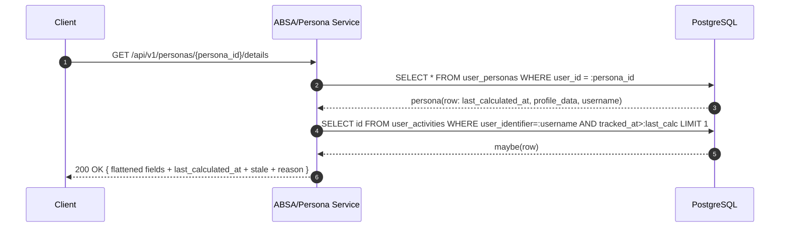
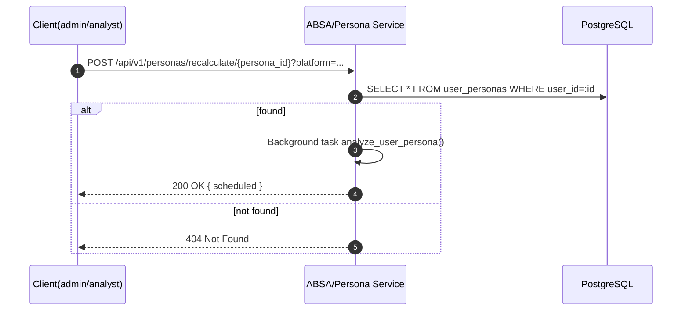
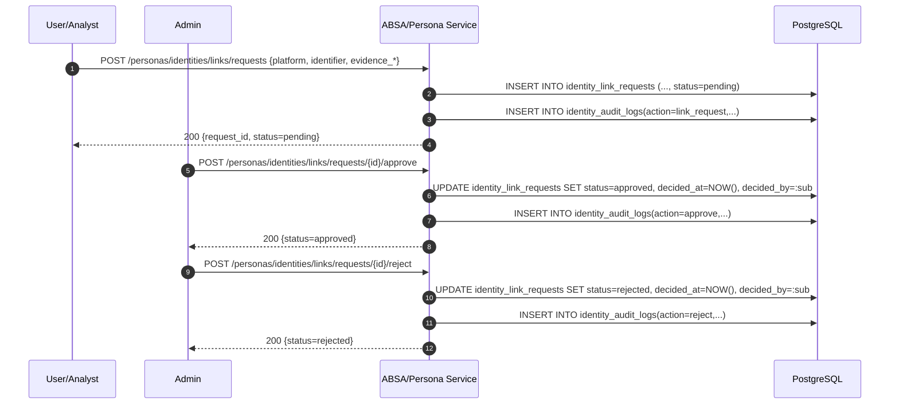
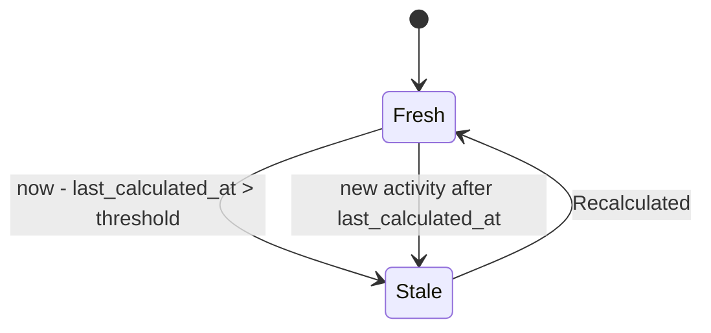
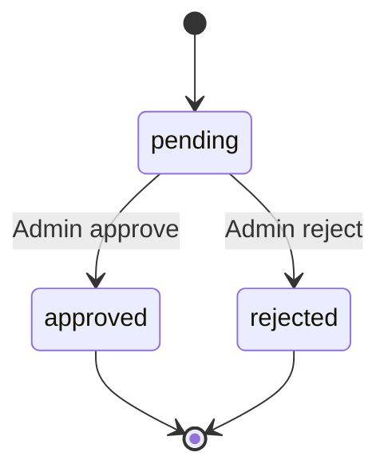

# 개요
속성 기반 감성 분석(ABSA)과 페르소나 분석/네트워크/트렌딩/신선도 관리/신원 링크 워크플로우를 제공합니다.

# 코드 기준
- 라우터: `BACKEND-ABSA-SERVICE/app/routers/personas.py`
- 분석: `BACKEND-ABSA-SERVICE/app/services/persona_analyzer.py`
- 모델: `BACKEND-ABSA-SERVICE/app/models.py`
- 보안: `BACKEND-ABSA-SERVICE/app/security.py`
- 설정: `BACKEND-ABSA-SERVICE/app/config.py`, `app/main.py`

# 데이터 모델(요약)
- `UserPersona(last_calculated_at, profile_data JSON)`
- `UserConnection(connection_strength, avg_sentiment, topics)`
- `Content`, `Comment`, `UserActivity`
- `ABSAAnalysis`, `TrendingTopic`
- `IdentityLinkRequest`, `IdentityAuditLog`

# API
- 분석 실행: `GET /api/v1/personas/{user_identifier}/analyze?platform=&depth=`
- 상세 조회(평탄화/신선도): `GET /api/v1/personas/{persona_id}/details`
- 네트워크: `GET /api/v1/personas/network/{user_id}`
- 트렌딩: `GET /api/v1/personas/trending?time_window=&limit=&sentiment_filter=`
- 활동 트래킹: `POST /api/v1/personas/{user_identifier}/track`
- 연결 업데이트: `POST /api/v1/personas/connections/update`
- 재계산(단건): `POST /api/v1/personas/recalculate/{persona_id}` (admin/analyst)
- 신원 링크 요청: `POST /api/v1/personas/identities/links/requests` (admin/analyst/user)
- 링크 승인/거절: `POST /api/v1/personas/identities/links/requests/{id}/approve|reject` (admin)

# 신선도 모델
- 기준: `last_calculated_at` + `PERSONA_STALENESS_HOURS_DEFAULT(기본 24h)`
- 최근 활동 발생 시 stale
- Details 응답에 `last_calculated_at`, `stale`, `staleness_reason` 노출

# 인증/인가(RBAC)
- 승인/거절: admin 전용, 요청 생성: admin/analyst/user
- 모든 변경 행위 감사 로그 기록 필수

# 비기능
- 분석 깊이/타임아웃, 캐시, 런타임 안전 마이그레이션(`last_calculated_at`)

# 모니터링/KPI
- stale 페르소나 수, 재계산 지연, 트렌딩/네트워크 응답 시간

# 테스트/수용 기준
- Details 평탄화/신선도 필드 정확
- RBAC 차단/허용 동작 정확
- 트렌딩 `recent_activity_count` 실제 집계값

## 시퀀스 다이어그램

### Persona Details 조회 + 신선도 계산

### Persona 재계산(단건)

### Identity Link Request 생성/승인/거절(RBAC)

## 상태도(State Diagrams)

### Persona Freshness

### IdentityLinkRequest Workflow

## 메트릭 테이블

| Metric | Type | Labels | Description | Target/SLO |
|---|---|---|---|---|
| persona_details_latency_seconds | histogram | persona_id | 상세 조회 p95 | p95 ≤ 400ms |
| persona_trending_latency_seconds | histogram | time_window | 트렌딩 응답 p95 | p95 ≤ 500ms |
| persona_stale_total | gauge | | stale인 페르소나 수 | 감소 추세 |
| persona_recalc_duration_seconds | histogram | persona_id | 재계산 소요시간 | p95 ≤ 5s (샘플) |
| identity_link_requests_total | counter | action | 요청/승인/거절 이벤트 수 | n/a |
| identity_approval_tat_seconds | histogram | | 요청→승인 소요 | 하향 추세 |
