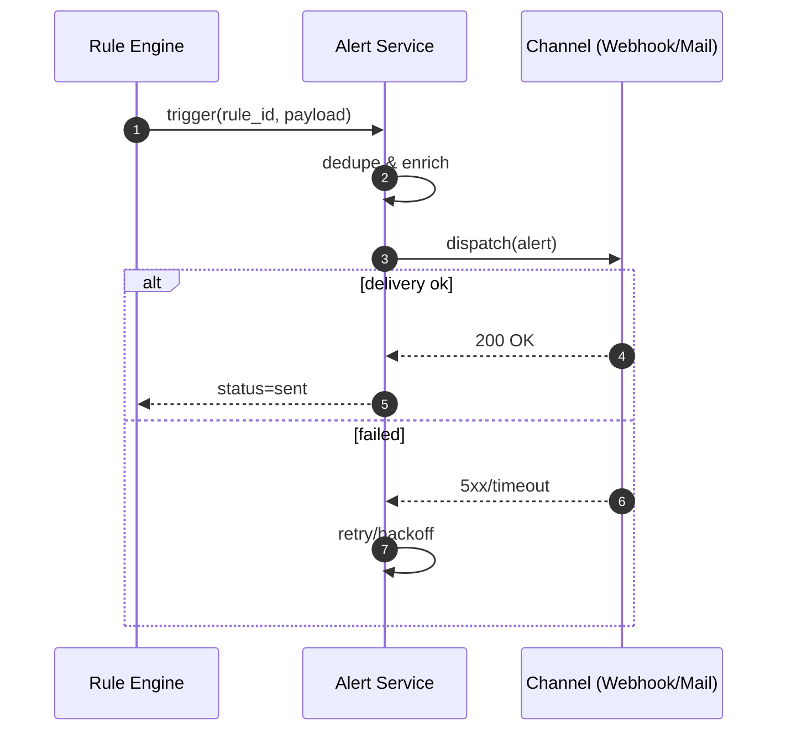
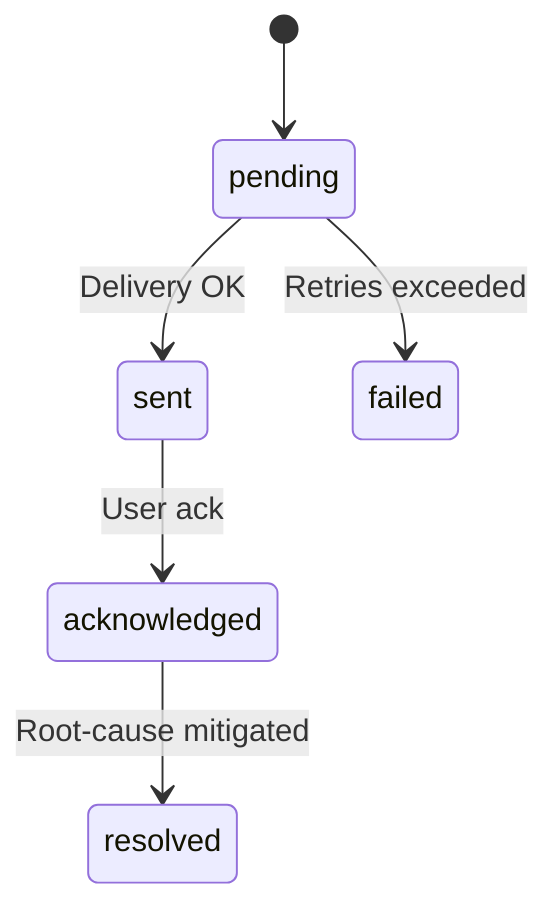

# 개요
감정 급등/트렌드 변화 등 규칙 기반 알림을 생성/전달합니다.

# 데이터 모델
`alerts` (status, title, message, data, timestamps)

# API(예)
- `POST /api/v1/alerts/rules`
- `GET /api/v1/alerts/events`
- `POST /api/v1/alerts/ack/{id}`

# 비기능
중복 억제, 히스테리시스, 재전송 정책

# 모니터링/KPI
알림 지연, 거짓양성율, ack rate

# 테스트/수용 기준
규칙 평가 정확, 전송 신뢰성

## 시퀀스 다이어그램

## 상태도(State Diagram)

## 메트릭 테이블

| Metric | Type | Labels | Description | Target/SLO |
|---|---|---|---|---|
| alert_events_total | counter | rule, status | 알림 이벤트 수 | n/a |
| alert_dispatch_latency_seconds | histogram | channel | 전송 지연 | p95 ≤ 2s |
| alert_ack_rate | gauge | rule | ACK 비율 | ≥ 80% |
| alert_false_positive_rate | gauge | rule | 오탐 비율 | ≤ 5% |
