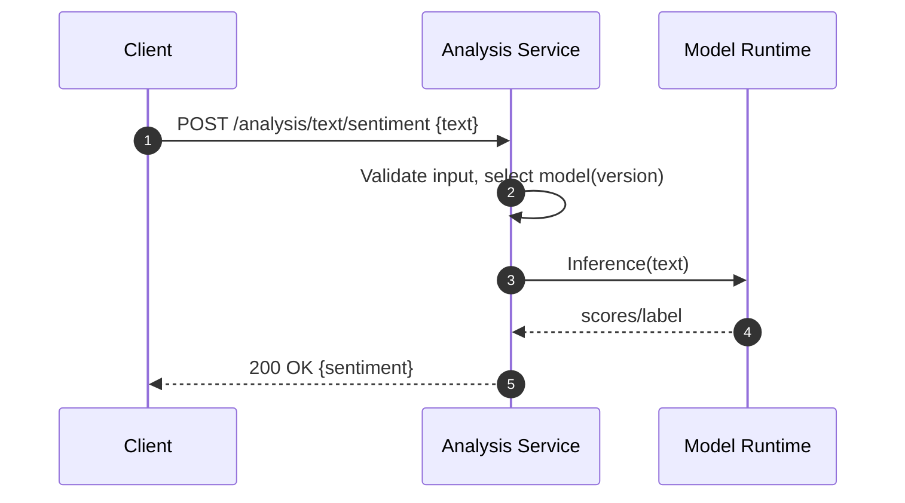
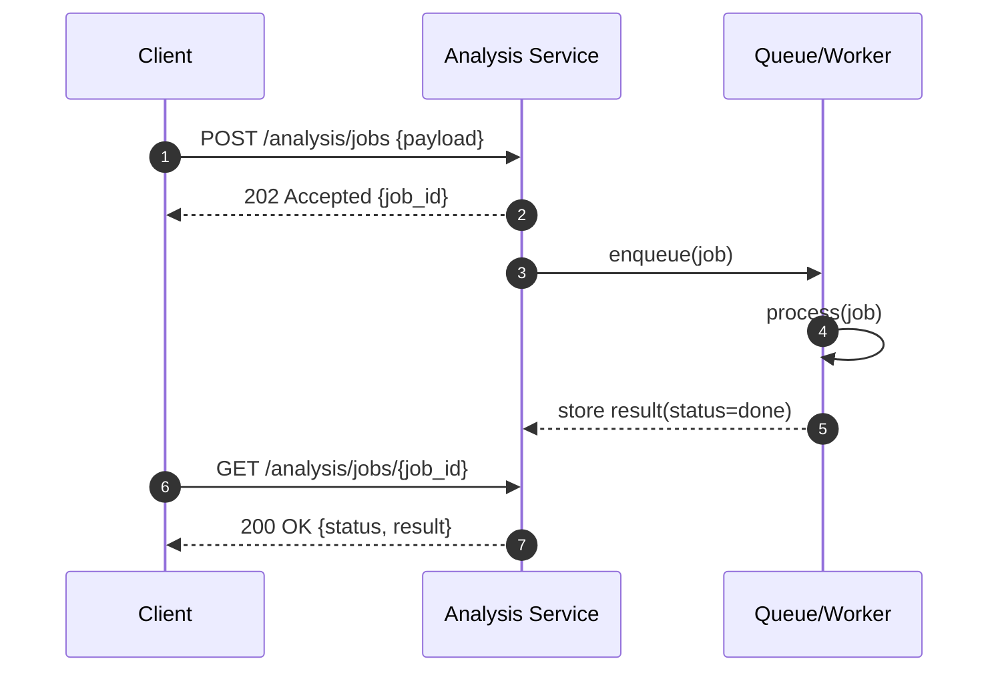
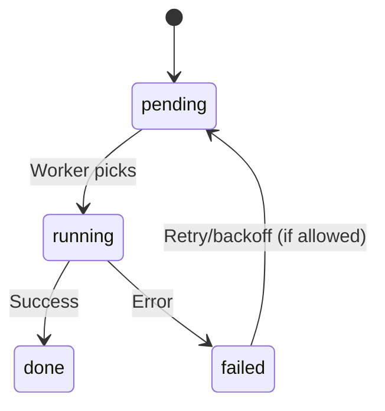

# 개요
고급 텍스트 분석(주제/엔티티/요약/감정)을 제공하며 ABSA/Persona와 독립된 API로 동작합니다.

# API(예)
- `POST /api/v1/analysis/text/sentiment`
- `POST /api/v1/analysis/text/topics`
- `POST /api/v1/analysis/text/entities`
- 비동기 배치: Job ID 발급, 상태 조회

# 설정/보안
- AUTH_REQUIRED, AUTH_JWT_SECRET, AUTH_JWT_ALG
- 동시성/큐 설정, 모델 버전 고정(재현성)

# 비기능
- 캐시(HF 모델 캐시), 시간 제한, 우선순위 큐

# 모니터링/KPI
- 처리량, p95, 모델 실패율, 큐 대기 시간

# 테스트/수용 기준
- 입력 유효성, 모델 버전 고정성, 재현성

## 시퀀스 다이어그램

### 동기 분석 요청

### 비동기 배치 분석(Job)

## 상태도(State Diagram)

## 메트릭 테이블

| Metric | Type | Labels | Description | Target/SLO |
|---|---|---|---|---|
| analysis_requests_total | counter | route, model | 총 요청 수 | n/a |
| analysis_request_duration_seconds | histogram | route, model | 요청 지연 | p95 ≤ 600ms |
| analysis_job_queue_length | gauge | queue | 대기 잡 수 | 모니터 |
| analysis_job_duration_seconds | histogram | model | 잡 처리 시간 | p95 ≤ 5s |
| analysis_model_errors_total | counter | model, reason | 모델 실패 수 | 1% 이하 |
