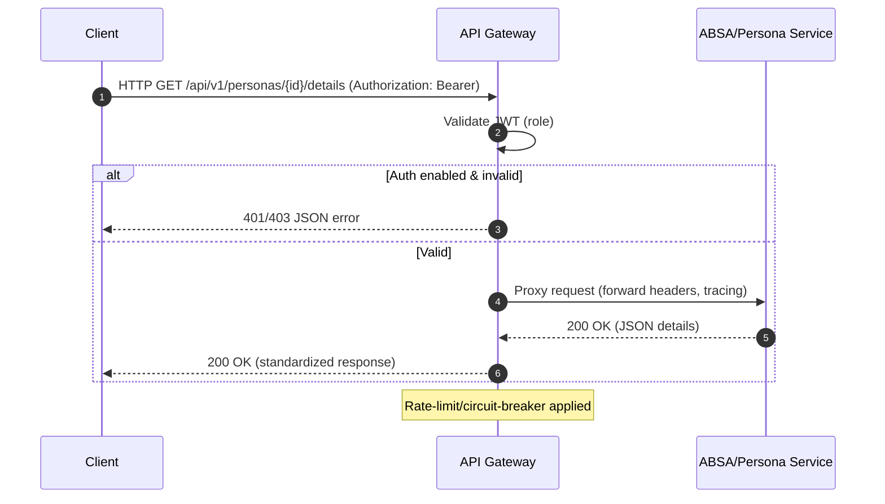

# 개요
API Gateway는 외부 클라이언트의 단일 진입점으로 인증/인가, 레이트 리밋, 라우팅, 에러 표준화를 담당합니다. 백엔드 마이크로서비스(ABSA/Persona, Analysis, Collector, Alert 등)의 엔드포인트를 일관된 규약으로 노출합니다.

# 목표 및 비범위
- 목표
  - 인증/인가(RBAC), 요청 라우팅, 표준 에러 응답, 기본 관찰성(로그/트레이싱/메트릭)
- 비범위
  - 도메인 로직(분석/수집/알림) 수행, 데이터 변환(어그리게이션 제외)

# 설정(12-Factor)
- AUTH_REQUIRED, AUTH_JWT_SECRET, AUTH_JWT_ALG
- RATE_LIMIT_*, REQUEST_TIMEOUT, UPSTREAM_TIMEOUT
- 서비스별 업스트림 URL: ABSA_SERVICE_URL, ANALYSIS_SERVICE_URL, COLLECTOR_SERVICE_URL, ALERT_SERVICE_URL

# 인증/인가
- JWT(HS256, `sub`, `role`) 검증
- 기본 역할: admin/analyst/user
- 경로별 정책 예시
  - `/api/v1/personas/identities/links/requests/*`: approve/reject → admin 전용, create → admin/analyst/user 허용

# 라우팅 규칙(예시)
- `/api/v1/personas/*` → ABSA Service
- `/api/v1/analysis/*` → Analysis Service
- `/api/v1/collector/*` → Collector Service
- `/api/v1/alerts/*` → Alert Service

# 에러 표준화
- 4xx/5xx JSON 포맷: `{ "success": false, "error": { "code": "...", "message": "...", "details": {...} } }`

# 비기능 요구사항
- p95 ≤ 300ms(게이트웨이 자체 처리), 서킷브레이커, 재시도(멱등 GET), 백프레셔
- HPA/오토스케일, 무중단 배포

# 모니터링/KPI
- 요청 성공률, p95, 4xx/5xx 비율, 토큰 검증 실패율, 업스트림별 오류율

# 테스트/수용 기준
- 권한 없음 → 403, 인증 없음 → 401
- 라우팅 정확성, 타임아웃/재시도 동작 검증
- 레이트 리밋 초과 시 429

## 시퀀스 다이어그램

## 메트릭 테이블

| Metric | Type | Labels | Description | SLO/Threshold |
|---|---|---|---|---|
| gateway_requests_total | counter | route, method, status | 총 요청 수 | n/a |
| gateway_request_duration_seconds | histogram | route, method | 요청 지연 | p95 ≤ 300ms |
| gateway_upstream_errors_total | counter | upstream, reason | 업스트림 오류 수 | 0.5% 이하 |
| gateway_auth_failures_total | counter | reason | 인증/인가 실패 수 | 추이 모니터 |
| gateway_rate_limited_total | counter | route | 429 발생 수 | 급증 경보 |
