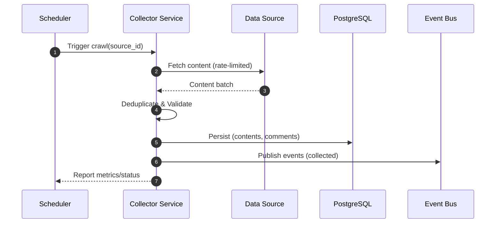
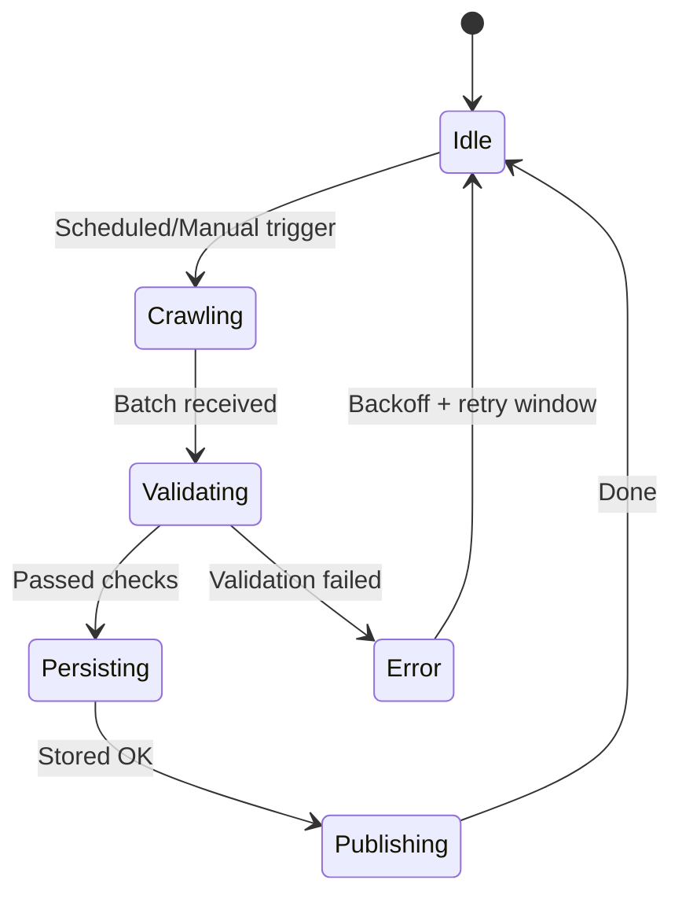

# 개요
공식 소스(국민연금공단/보건복지부/연구원/RSS/커뮤니티)에서 실데이터 수집. Mock 금지.

# 파이프라인
스케줄러 → 수집 → 정규화/중복제거 → 검증 → 영속화 → 이벤트 발행

# 데이터 소스 정책
화이트리스트(`data/REAL_DATA_SOURCES.md`)만, robots.txt 준수, rate-limit/쿨다운, SSL 검증

# 설정
소스별 주기/상한, 타임아웃/재시도, 실패 격리

# 비기능
중복 방지(해시/URL), 변경 감지 정확도 ≥ 98%

# 모니터링/KPI
크롤링 속도, 실패율, 중복률, 최신성

# 테스트/수용 기준
허용 도메인만 수집, 변경 감지율 목표 충족

## 품질 보증 파이프라인(QA)

- 단계
  1) 네트워크/도메인 검증(옵션): HEAD/GET 상태 확인, 화이트리스트 도메인(`qa_domain_whitelist`)만 PASS
  2) 콘텐츠 검증: 최소 길이(`qa_min_content_length`) 충족, 존재 여부 확인
  3) 중복 제거: `url+title+content` 해시 기반 중복 차단
  4) 정규화/표준화: 공백/문자 정규화, 메타데이터 표준화
  5) 의미 일관성/이상치: 키워드 기반 `semantic_consistency`, 길이 기반 `outlier_score`
  6) 신뢰/품질 점수: `trust_score`(도메인+네트워크)와 종합 `quality_score` 산출

- 설정(환경변수/설정)
  - `QA_ENABLE_NETWORK_CHECKS` (default: false)
  - `qa_domain_whitelist` (기본: nps.or.kr, mohw.go.kr, institute.nps.or.kr)
  - `QA_MIN_CONTENT_LENGTH` (default: 40)
  - `qa_expected_keywords` (기본: 연금/국민연금/NPS/제도/기금)

## 시퀀스 다이어그램

## 상태도(State Diagram)

## 메트릭 테이블

| Metric | Type | Labels | Description | Target/SLO |
|---|---|---|---|---|
| collector_pages_per_minute | gauge | source | 분당 수집 페이지 수 | ≥ 목표치 |
| collector_errors_total | counter | source, reason | 수집 오류 수 | 하향 추세 |
| collector_duplicates_total | counter | source | 중복 제거 건수 | 하향 추세 |
| collector_data_freshness_seconds | histogram | source | 최신성(수집 시각-게시 시각) | 하향 추세 |
| collector_backoff_seconds | histogram | source | 백오프 대기 시간 | 안정화 |
