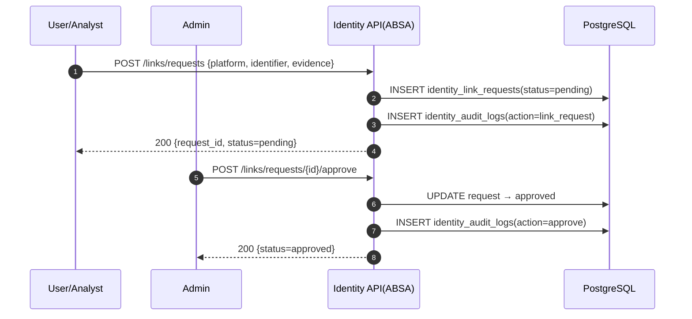
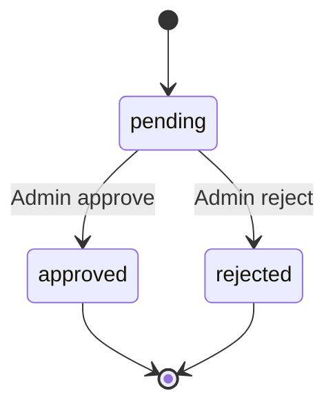

# 개요
교차 플랫폼 신원 연계를 증빙 기반으로 수행. RBAC와 감사 로그로 안전성/추적성 보장.

# 워크플로우
요청 생성(증빙) → 관리자 승인/거절 → 감사 로그 기록

# 엔드포인트(ABSA에 구현)
- `POST /api/v1/personas/identities/links/requests` (admin/analyst/user)
- `POST /api/v1/personas/identities/links/requests/{id}/approve` (admin)
- `POST /api/v1/personas/identities/links/requests/{id}/reject` (admin)

# 데이터 모델
- `IdentityLinkRequest`(platform, identifier, status, evidence_*)
- `IdentityAuditLog`(action, actor, details)

# 보안/RBAC
- 승인/거절 admin 전용, 요청 생성은 user/analyst/admin 허용
- 레이트 리밋/쿨다운 적용(향후)

# 테스트/수용 기준
- 무권한 승인/거절 차단, 감사 로그 생성

## 시퀀스 다이어그램

## 상태도(State Diagram)

## 메트릭 테이블

| Metric | Type | Labels | Description | Target/SLO |
|---|---|---|---|---|
| identity_link_requests_total | counter | status, platform | 요청 수/상태 | n/a |
| identity_link_tat_seconds | histogram | status | 요청→결정 TAT | 하향 추세 |
| identity_audit_log_entries_total | counter | action | 감사 로그 건수 | n/a |
