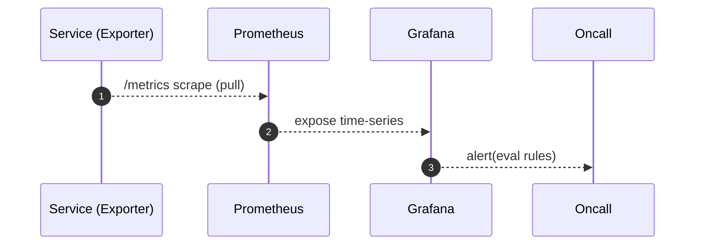

# 개요
서비스 상태, 성능, 품질 가시화. 얼럿 기준 설정.

# 메트릭
- 게이트웨이: 성공률, p95, 4xx/5xx, 토큰 실패율
- ABSA/Persona: stale 수, 재계산 지연, 트렌딩/네트워크 레이턴시
- Collector: 크롤링 속도/실패율/중복률
- Alert: 알림 지연/ack rate

# 대시보드
- Persona Freshness, Recalc Latency, Identity Link Funnel

# 테스트/수용 기준
- 주요 대시보드 제공, 라벨 표준화

## 시퀀스 다이어그램

