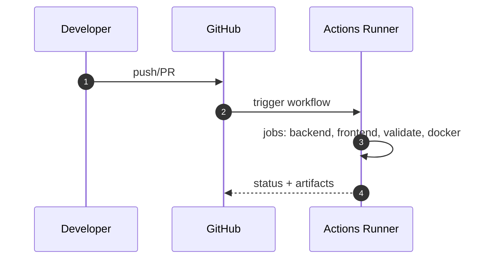
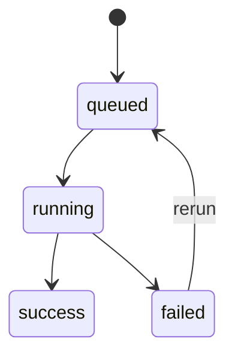

# 개요
PR/Push 시 정적 검사, 단위/통합 테스트, 빌드 검증을 수행. 조건부로 Docker 빌드/배포.

# 트리거
- push: main/dev/feature/**/*, PR 전 구간

# 잡 구성
- backend-python: ABSA 서비스 테스트/품질 검사
- frontend-web: React 대시보드 빌드/테스트(조건)
- validate-script: 리포지토리 검증 스크립트 실행(있을 경우)
- docker-build: Dockerfile 존재 시 빌드 검증(배포 자격 증명 있으면 push)

# 아티팩트/캐시
- pip, npm 캐시, 테스트 리포트/커버리지(optional)

# 시크릿/보안
- 배포 단계는 시크릿 존재 시에만 활성(조건부)

# 수용 기준
- 실패 원인 표준화된 로그, 재현 가능, 비결정성 제거

## 시퀀스 다이어그램

## 상태도(State Diagram)

## 메트릭 테이블

| Metric | Type | Labels | Description | Target/SLO |
|---|---|---|---|---|
| ci_build_duration_seconds | histogram | job | 잡 수행 시간 | 하향 추세 |
| ci_failed_jobs_total | counter | job | 실패 잡 수 | 0에 수렴 |
| ci_flakiness_rate | gauge | job | 불안정 실패율 | ≤ 목표 |
