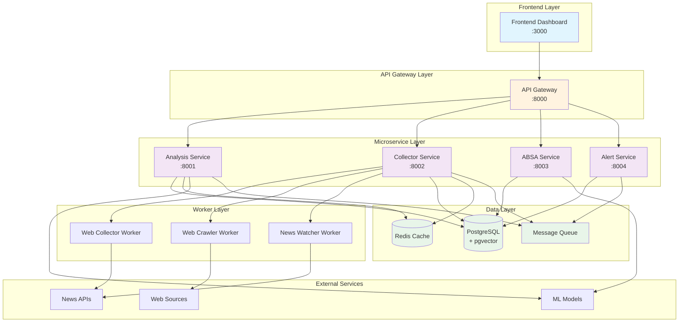
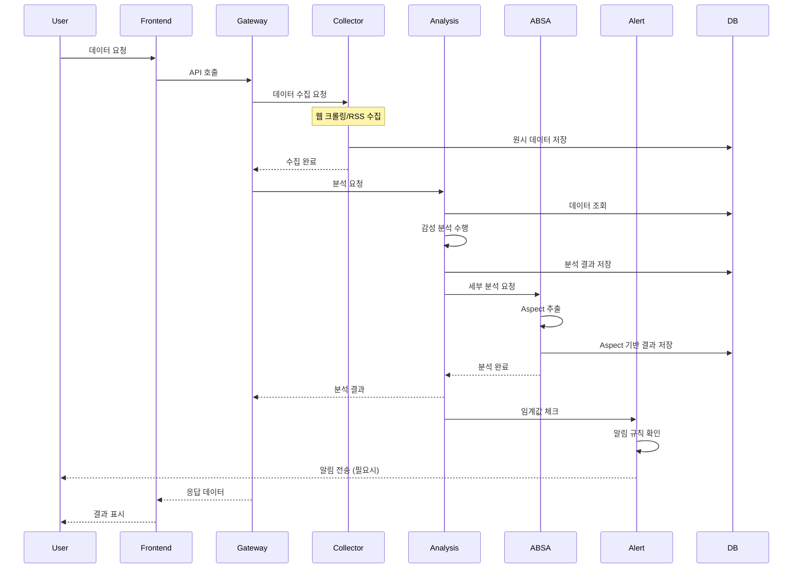
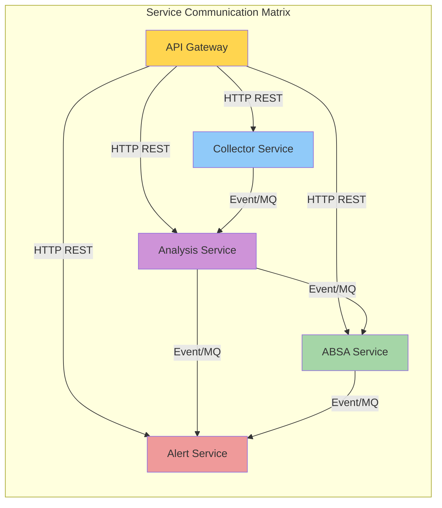
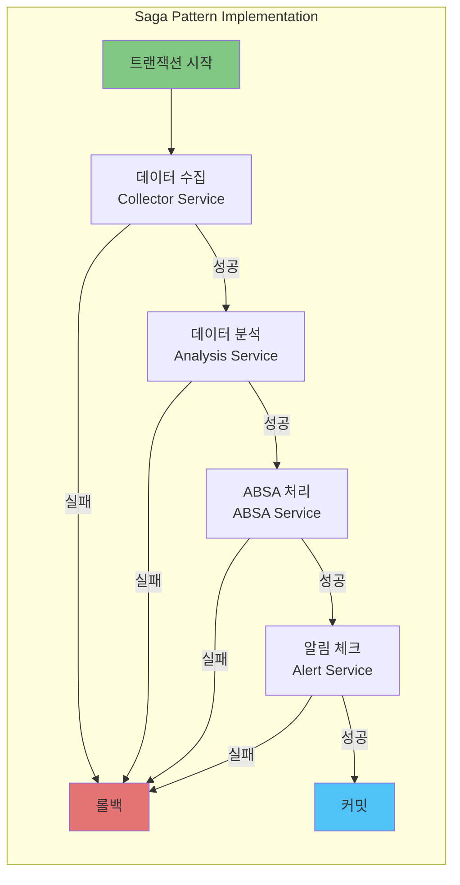
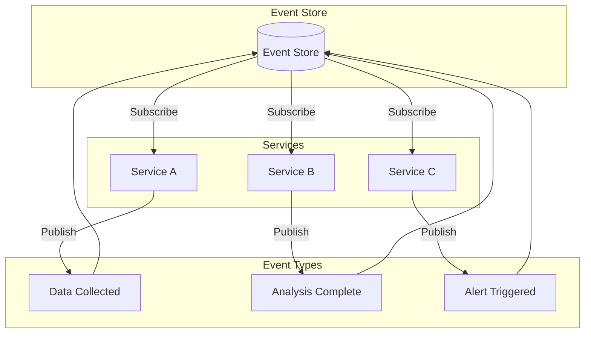
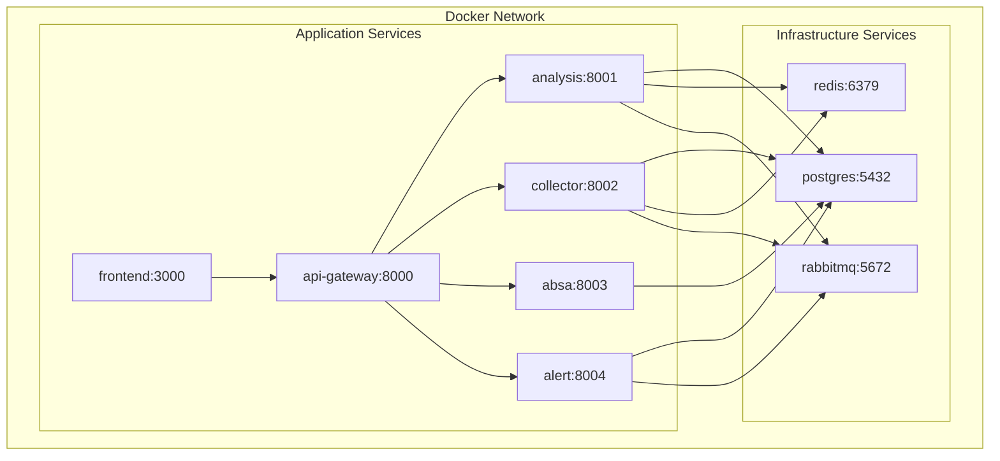
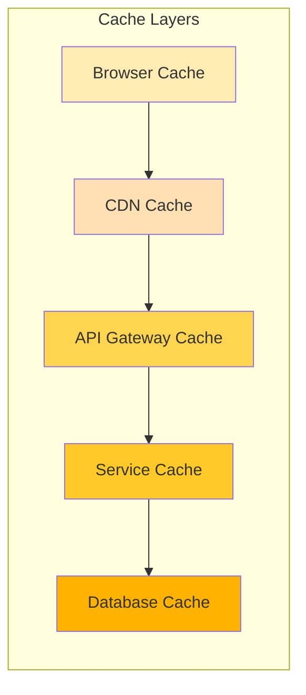

# Microservice Architecture (MAS) - 연금 감성 분석 시스템

## 시스템 개요

연금 감성 분석 시스템은 마이크로서비스 아키텍처(MAS)를 기반으로 구축되어 있으며, 각 서비스는 독립적으로 배포 및 확장 가능합니다.

## 시스템 아키텍처 다이어그램

### 1. 전체 시스템 구성도



### 2. 데이터 플로우 다이어그램



### 3. 서비스 간 통신 매트릭스



## 서비스별 상세 구성

### API Gateway (포트: 8080)
- **역할**: 모든 마이크로서비스에 대한 단일 진입점
- **기능**:
  - 라우팅 및 로드 밸런싱
  - 인증 및 권한 관리
  - Rate limiting
  - 서비스 헬스 체크
- **엔드포인트**:
  - `/api/v1/analysis/*` → Analysis Service
  - `/api/v1/collector/*` → Collector Service
  - `/api/v1/absa/*` → ABSA Service
  - `/api/v1/alerts/*` → Alert Service

### Analysis Service (포트: 8001)
- **역할**: 감성 분석 및 트렌드 분석
- **기능**:
  - 감성 점수 계산
  - 트렌드 분석
  - 리포트 생성
  - ML 모델 관리
- **라우터**:
  - `/sentiment` - 감성 분석
  - `/trends` - 트렌드 분석
  - `/reports` - 리포트 생성
  - `/models` - ML 모델 관리

### Collector Service (포트: 8002)
- **역할**: 데이터 수집 및 관리
- **기능**:
  - 웹 크롤링
  - RSS 피드 수집
  - 뉴스 API 연동
  - 데이터 전처리
- **라우터**:
  - `/sources` - 데이터 소스 관리
  - `/collections` - 수집 작업 관리
  - `/feeds` - RSS 피드 관리

### ABSA Service (포트: 8003)
- **역할**: Aspect 기반 감성 분석
- **기능**:
  - Aspect 추출
  - Aspect별 감성 분석
  - 세부 분석 리포트
- **라우터**:
  - `/aspects` - Aspect 추출
  - `/analysis` - ABSA 분석
  - `/models` - ABSA 모델 관리

### Alert Service (포트: 8004)
- **역할**: 알림 및 경고 시스템
- **기능**:
  - 알림 규칙 관리
  - 실시간 알림 전송
  - 알림 히스토리 관리
- **라우터**:
  - `/alerts` - 알림 관리
  - `/rules` - 알림 규칙
  - `/notifications` - 알림 전송

## 트랜잭션 관리

### 1. 분산 트랜잭션 패턴



### 2. 이벤트 소싱 패턴



## 배포 아키텍처

### Docker Compose 구성



## 확장성 및 성능 최적화

### 1. 수평 확장 전략

- **API Gateway**: 로드 밸런서 뒤에 다중 인스턴스 배치
- **Analysis Service**: CPU 집약적 작업을 위한 오토스케일링
- **Collector Service**: 동시 수집 작업을 위한 워커 풀
- **ABSA Service**: GPU 기반 ML 처리를 위한 전용 노드
- **Alert Service**: 실시간 처리를 위한 인메모리 캐싱

### 2. 캐싱 전략



## 모니터링 및 로깅

### 1. 모니터링 스택

- **Prometheus**: 메트릭 수집
- **Grafana**: 시각화 대시보드
- **ELK Stack**: 로그 수집 및 분석
- **Jaeger**: 분산 트레이싱

### 2. 헬스 체크 엔드포인트

모든 서비스는 `/health` 엔드포인트를 제공하며, 다음 정보를 반환합니다:
- 서비스 상태
- 데이터베이스 연결 상태
- 의존 서비스 상태
- 응답 시간

## 보안 고려사항

### 1. 인증 및 권한 관리

- JWT 기반 인증
- OAuth 2.0 지원
- Role-based Access Control (RBAC)
- API Key 관리

### 2. 네트워크 보안

- TLS/SSL 암호화
- VPN 터널링
- 방화벽 규칙
- DDoS 보호

## 개발 환경 설정

### 로컬 개발

```bash
# Docker Compose로 전체 시스템 실행
docker-compose -f docker-compose.msa.yml up

# 개별 서비스 실행
cd BACKEND-{SERVICE_NAME}
python -m venv venv
source venv/bin/activate
pip install -r requirements.txt
python app/main.py
```

### 환경 변수 설정

각 서비스는 `.env` 파일을 통해 설정됩니다:
- `DATABASE_URL`: PostgreSQL 연결 문자열
- `REDIS_URL`: Redis 연결 문자열
- `RABBITMQ_URL`: RabbitMQ 연결 문자열
- `SERVICE_PORT`: 서비스 포트
- `DEBUG`: 디버그 모드
- `LOG_LEVEL`: 로깅 레벨
