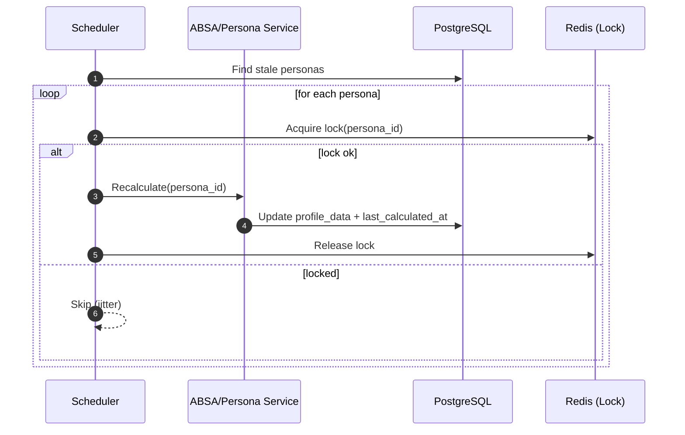
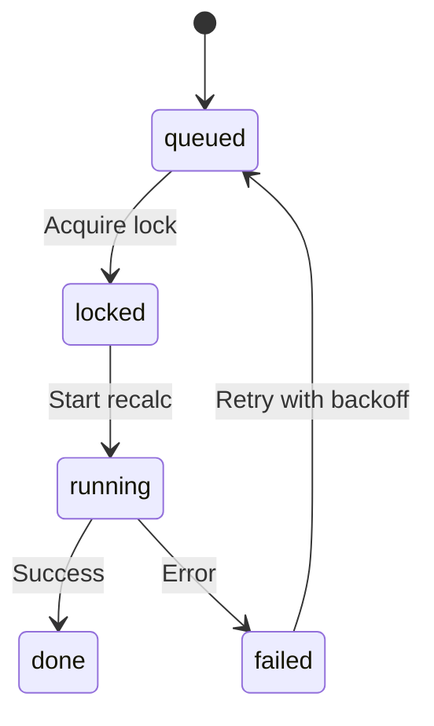

# 개요
stale 페르소나를 배치로 재계산. 분산락/지터로 동시 폭주 방지.

# 로직
- 스캔: `last_calculated_at` 대비 임계 초과 또는 최근 활동 발생 시 대상 선정
- 락: Redis 분산락(키: persona_id), 지터 도입
- 실행: ABSA 재계산 호출(깊이/타임아웃)

# 설정
- `PERSONA_STALENESS_HOURS_DEFAULT`, `REDIS_URL`, 배치 크기/동시성/락 TTL

# 모니터링/KPI
- 배치 처리량, 실패율, 평균 재계산 지연, stale 감소율

# 테스트/수용 기준
- 중복 작업 방지, SLA 내 처리

## 시퀀스 다이어그램

## 상태도(State Diagram)

## 메트릭 테이블

| Metric | Type | Labels | Description | Target/SLO |
|---|---|---|---|---|
| persona_scheduler_batch_size | gauge | | 배치 크기 | 모니터 |
| persona_scheduler_lock_conflicts_total | counter | | 락 충돌 수 | 하향 추세 |
| persona_recalc_jobs_total | counter | status | 재계산 잡 수 | n/a |
| persona_recalc_duration_seconds | histogram | | 재계산 시간 | p95 ≤ 목표 |
