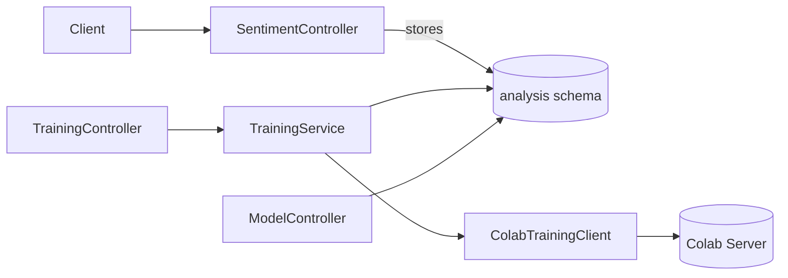

# Analysis Service

Spring Boot 서비스로 감성 분석, ABSA, 모델 학습 파이프라인, 그리고 표준화된 리포트 생성을 담당합니다. Colab 학습 서버와 WebClient로 통신하며, PostgreSQL `analysis` 스키마에 모든 분석/학습 기록을 저장합니다.

## 1. 주요 책임

| 영역 | 설명 |
| --- | --- |
| 실시간 감성 분석 | `/api/v1/sentiment` 엔드포인트에서 단건/배치 분석, 히스토리, 통계를 제공합니다. |
| 모델 학습 제어 | `/api/v1/training` 에서 Colab 학습 서버로 데이터셋, 하이퍼파라미터를 전송하고 콜백을 수신합니다. |
| 모델 관리 | `/api/v1/models` 로 모델 업로드, 목록/상세 조회, 활성화 등을 수행합니다. |
| 표준 리포트 | `/api/v1/analysis/report` (추가 예정) 를 통해 통합된 CSV/JSON 분석 보고서를 제공합니다. |
| 트렌드/에이전트 | 트렌드 분석, 에이전트 검색 등 보조 API 제공. |

## 2. 아키텍처 개요



- **SentimentService**: Colab inference 실패 시 rule-based fallback, 그리고 모든 결과를 통합 스키마로 저장합니다.
- **TrainingService**: MLModelEntity · TrainingJobEntity를 함께 생성하고, Colab 콜백으로 상태/메트릭을 갱신합니다.
- **AnalysisReportService (예정)**: JPA Specification 기반 필터링으로 표준 레코드를 조회하고 JSON/CSV로 변환합니다.
- **ColabIntegration**: `ColabClient`(inference)와 `ColabTrainingClient`(학습)이 API 키 기반으로 Colab 서버와 통신합니다.

## 3. 데이터 모델

### 3.1 sentiment_analysis (통합 레코드)

| 컬럼 | 타입 | 설명 |
| --- | --- | --- |
| `analysis_type` | VARCHAR(50) | `SENTIMENT`, `ABSA` 등 |
| `aspect` | VARCHAR(100) | 문서 전체는 `GLOBAL`, ABSA 는 속성명 |
| `sentiment_score` | DOUBLE | 모델 점수/확률 (−1 ~ 1 혹은 확률) |
| `sentiment_label` | VARCHAR(50) | 예측 라벨 (positive/negative/neutral 등) |
| `true_label` | VARCHAR(50) | 정답 라벨이 있을 경우 |
| `source` | VARCHAR(100) | 예: `colab:sentiment`, `fallback:rule-based`, `colab:absa` |
| `tags_json` | JSONB | 태그 리스트 (필요 시) |
| `model_type` | VARCHAR(50) | `sentiment`, `absa`, ... |
| `training_job_id` | VARCHAR(100) | 연결된 학습 Job ID |
| `analyzed_at`, `created_at`, `updated_at` | TIMESTAMPTZ | 감사 메타 |

### 3.2 training_jobs

Colab 학습 파이프라인 상태를 추적합니다 (job_id, task_type, status, metrics, error_message 등).

### 3.3 ml_models

모델 메타데이터, 하이퍼파라미터, 메트릭, 활성화 상태를 저장합니다.

> PostgreSQL 스키마는 `infrastructure/db/init.sql` 에 포함되어 있습니다.

## 4. API 요약

| Method | Path | 설명 |
| --- | --- | --- |
| `POST` | `/api/v1/sentiment/analyze` | 단일 감성 분석 |
| `POST` | `/api/v1/sentiment/batch` | 배치 감성 분석 |
| `GET` | `/api/v1/sentiment/history/{contentId}` | 히스토리 조회 |
| `GET` | `/api/v1/sentiment/stats` | 통계 조회 |
| `POST` | `/api/v1/training/{taskType}/start` | 학습 시작 (`taskType=SENTIMENT/ABSA`) |
| `POST` | `/api/v1/training/callback` | Colab 학습 결과 콜백 |
| `GET` | `/api/v1/training/{jobId}` | 학습 Job 상태 조회 |
| `POST` | `/api/v1/models/upload` | 모델 업로드 |
| `GET` | `/api/v1/models` | 모델 목록 |
| `POST` | `/api/v1/analysis/report` (예정) | 필터링된 JSON 리포트 |
| `POST` | `/api/v1/analysis/report/csv` (예정) | CSV 다운로드 |

### 샘플: 학습 요청 (Light-mode)

```http
POST /api/v1/training/sentiment/start
Content-Type: application/json
X-Callback-Base: https://analysis.example.com
{
  "dataset": {
    "examples": [
      { "text": "좋은 펀드입니다.", "label": "positive" },
      { "text": "수익률이 낮다", "label": "negative" }
    ]
  },
  "hyperparameters": {
    "epochs": 3,
    "batch_size": 16,
    "learning_rate": 5e-5
  }
}
```

### 샘플: Colab 콜백

```json
{
  "jobId": "train-123",
  "status": "COMPLETED",
  "metrics": { "accuracy": 0.91, "loss": 0.12 },
  "modelPath": "gs://models/sentiment/train-123",
  "errorMessage": null
}
```

## 5. 환경 변수 / 설정

| Key | 설명 | 기본값 |
| --- | --- | --- |
| `DB_HOST`, `DB_PORT`, `DB_NAME`, `DB_USER`, `DB_PASSWORD` | PostgreSQL 접속 정보 | `localhost`, `5432`, `osint_db`, `osint_user`, `osint_password` |
| `COLAB_API_KEY` | Colab 서버 API 키 | `capstone-secret-api-key` |
| `SPRING_PROFILES_ACTIVE` | `dev`, `prod` 등 | `dev` |
| `X-Callback-Base` | 학습 요청 시 콜백 베이스 URL (헤더) | `http://localhost:8080` |

`application.yml`에서 JPA 설정, Actuator 노출, Perplexity/Consul/ai-serve 관련 값도 확인할 수 있습니다.

## 6. 개발 & 실행

```bash
# Gradle 빌드
./gradlew :analysis:build

# 로컬 실행 (dev profile, ddl-auto=update)
SPRING_PROFILES_ACTIVE=dev ./gradlew :analysis:bootRun

# Docker 이미지 빌드
cd services/java/analysis
docker build -t capstone-analysis .
```

## 7. Colab 연동 요약

1. AdminController `/api/v1/admin/colab-url` 로 Colab ngrok URL을 등록합니다.
2. TrainingController 가 Colab `/train` 엔드포인트로 요청을 전송합니다.
3. Colab 서버는 학습 완료 후 `/api/v1/training/callback` 으로 결과를 POST 합니다.
4. SentimentService / ABSA 저장 로직은 `analysis.sentiment_analysis` 테이블에 통합 포맷으로 기록합니다.

## 8. 향후 작업 메모

- AnalysisReportService/Controller 구현 및 문서화
- ABSA 결과 저장 메서드 (`saveAbsaResults`) 노출 및 문서 예제 추가
- Collector · ABSA 등 다른 서비스 README 최신화 (요청 순서에 따라 진행)
