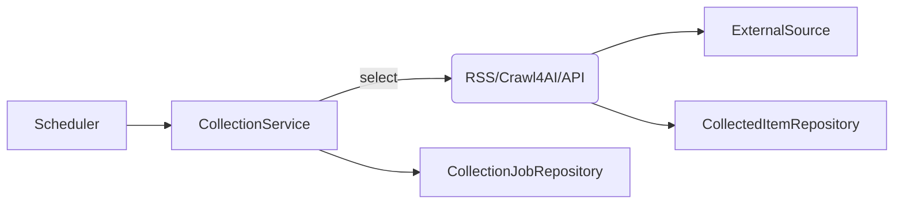

# Collector Service

Spring Boot 서비스로 RSS, Crawl4AI, API 등 다양한 전략을 통해 OSINT 데이터를 수집하고 저장합니다. 수집 작업(Job) 관리, 실패 재시도, 메타데이터 저장을 담당하며 향후 Analysis 서비스와 연동할 예정입니다.

## 1. 주요 기능

| 영역 | 설명 |
| --- | --- |
| 수집 전략 | `CollectionStrategy` 인터페이스를 기반으로 RSS, Crawl4AI, API 등 전략 확장 |
| 작업 관리 | `CollectionService`에서 작업 생성, 실행, 재시도, 상태 업데이트 |
| 데이터 저장 | `CollectionJobEntity`, `CollectedItemEntity` 를 통해 결과를 RDB에 저장 |
| 연계 준비 | 향후 Kafka/REST Hook 로 Analysis 서비스에 데이터 전달 (TODO) |

## 2. 아키텍처 개요



- **CollectionController**: `/api/v1/collect` 하위 API 제공
- **CollectionService**: 전략 실행, 예외 처리, 로그 기록
- **CollectionStrategy 구현체**: `RssCollectionStrategy`, `Crawl4aiCollectionStrategy` 등
- **Repository/Entity**: 작업/아이템 저장 및 조회

## 3. 데이터 모델

### 3.1 collection_jobs

| 컬럼 | 설명 |
| --- | --- |
| `job_id` | PK (UUID) |
| `source_type` | RSS / CRAWL4AI / API |
| `status` | CREATED / RUNNING / SUCCESS / FAILED |
| `payload` | JSON, 전략별 설정 |
| `started_at`, `finished_at` | 작업 시간 기록 |

### 3.2 collected_items

| 컬럼 | 설명 |
| --- | --- |
| `id` | PK |
| `job_id` | 참조 (collection_jobs.job_id) |
| `title`, `content`, `url`, `author`, `published_at` | 수집 데이터 메타 |
| `metadata_json` | 태그/분류 등 자유 메타 |

## 4. 대표 API

| Method | Path | 설명 |
| --- | --- | --- |
| `POST` | `/api/v1/collect/jobs` | 수집 작업 생성 |
| `GET` | `/api/v1/collect/jobs/{jobId}` | 개별 작업 상태 조회 |
| `GET` | `/api/v1/collect/jobs` | 작업 목록/필터 조회 |
| `POST` | `/api/v1/collect/jobs/{jobId}/retry` | 실패한 작업 재시도 |

### 예시: RSS 작업 생성

```http
POST /api/v1/collect/jobs
Content-Type: application/json
{
  "sourceType": "RSS",
  "payload": {
    "feedUrl": "https://news.google.com/rss/search?q=%EC%97%B0%EA%B8%88"
  }
}
```

## 5. 환경 변수 / 설정

| Key | 설명 | 기본값 |
| --- | --- | --- |
| `DB_HOST`, `DB_NAME`, `DB_USER`, `DB_PASSWORD` | PostgreSQL 접속 정보 | `localhost`, `osint_db`, ... |
| `CRAWL4AI_BASE_URL` | Crawl4AI 엔드포인트 | `http://crawl4ai:8080` |
| `CRAWL4AI_API_KEY` | Crawl4AI 인증 키 | 빈 문자열 |
| `RSS_TIMEOUT_MS` | RSS 요청 타임아웃 | 10000 |

세부 설정은 `src/main/resources/application.yml` 참고.

## 6. 실행

```bash
./gradlew :collector:build
SPRING_PROFILES_ACTIVE=dev ./gradlew :collector:bootRun

cd services/java/collector
docker build -t capstone-collector .
```

## 7. TODO

- Kafka Publish 또는 REST Hook 로 Analysis 서비스와 연동
- 정기 스케줄러(Quartz/Cron) 도입
- Collector ↔ Analysis 데이터 계약 문서화
