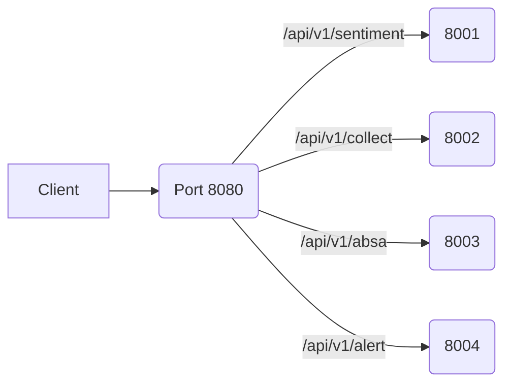

# API Gateway Service

Spring Cloud Gateway 기반으로 모든 외부 트래픽을 단일 진입점(포트 8080)에서 관리합니다. 각 마이크로서비스(analysis, collector, absa 등)로의 라우팅, 공통 헤더 주입, 보안 필터 등을 담당합니다.

## 1. 주요 역할

| 영역 | 설명 |
| --- | --- |
| 라우팅 | `/api/v1/**` 요청을 서비스별로 분기 (Analysis 8001, Collector 8002 등) |
| 필터/보안 | API 키 검증, 공통 추적 헤더 삽입, 레이트 리미터(확장 예정) |
| CORS/압축 | 공통 CORS 설정과 GZip 제공 |
| 헬스 체크 | `/actuator/**` 로 게이트웨이 자체 상태 확인 |

## 2. 아키텍처 개요



- `GatewayRoutes` 클래스에서 모든 라우트 및 필터를 정의합니다.
- Spring Cloud Gateway의 `RouteLocatorBuilder`로 경로 매칭, 헤더 추가, 토큰 검증 등을 구성합니다.

## 3. 라우팅 규칙 (예시)

| 경로 | 대상 서비스 |
| --- | --- |
| `/api/v1/sentiment/**` | [http://analysis-service:8001](http://analysis-service:8001) |
| `/api/v1/training/**` | [http://analysis-service:8001](http://analysis-service:8001) |
| `/api/v1/collect/**` | [http://collector-service:8002](http://collector-service:8002) |
| `/api/v1/absa/**` | [http://absa-service:8003](http://absa-service:8003) |
| `/api/v1/alert/**` | [http://alert-service:8004](http://alert-service:8004) |
| `/dashboard/**` | [http://frontend-dashboard:3000](http://frontend-dashboard:3000) |

> 구체적인 라우트/필터는 `src/main/java/com/capstone/gateway/config/GatewayRoutes.java` 참고.

## 4. 필터 & 보안

- **API Key Filter**: `X-API-KEY`를 검증하여 내부 서비스 보호 (설정 가능)
- **Tracing Header**: `X-Request-Id` 가 없으면 생성하여 라우팅
- **CORS**: `application.yml` 에서 허용 도메인/메서드 설정
- **Rate Limiting (TODO)**: Redis 기반 토큰 버킷 도입 예정

## 5. 환경 변수 / 설정

| Key | 설명 | 기본값 |
| --- | --- | --- |
| `GATEWAY_PORT` | 게이트웨이 포트 | 8080 |
| `ANALYSIS_BASE_URL` | 분석 서비스 URL | [http://analysis-service:8001](http://analysis-service:8001) |
| `COLLECTOR_BASE_URL` | 수집 서비스 URL | [http://collector-service:8002](http://collector-service:8002) |
| `ABSA_BASE_URL` | ABSA 서비스 URL | [http://absa-service:8003](http://absa-service:8003) |
| `ALERT_BASE_URL` | 알림 서비스 URL | [http://alert-service:8004](http://alert-service:8004) |
| `FRONTEND_BASE_URL` | 대시보드 URL | [http://frontend-dashboard:3000](http://frontend-dashboard:3000) |
| `API_GATEWAY_KEY` | 공통 API 키 | (환경별 주입) |

`src/main/resources/application.yml` 에서 위 값들을 프로파일별로 오버라이드 가능합니다.

## 6. 실행

```bash
./gradlew :gateway:build
SPRING_PROFILES_ACTIVE=dev ./gradlew :gateway:bootRun

cd services/java/gateway
docker build -t capstone-gateway .
```

## 7. TODO

- Rate Limiter 및 JWT 인증 필터 연결
- 중앙 로깅/모니터링 (Zipkin, Prometheus) 값 추가
- 라우팅 대상 서비스 변동 시 README / application.yml 동기화
